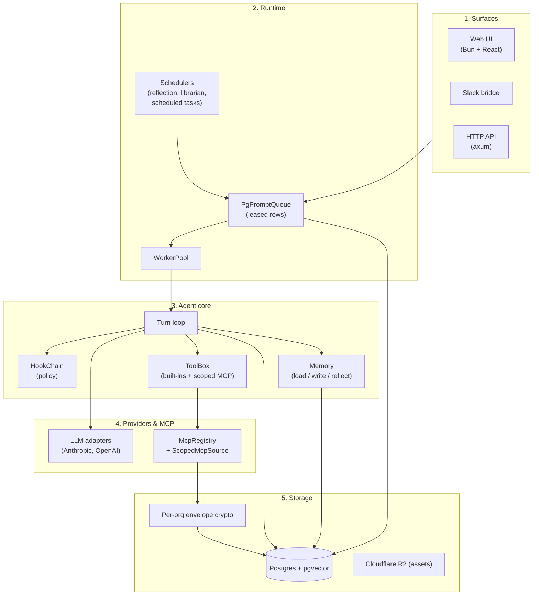
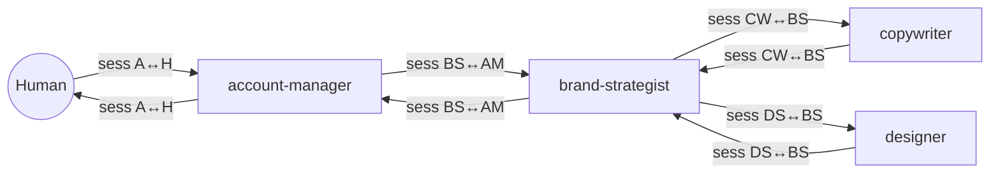

# Patom — Architecture

This is the single source of truth for **how Patom is built**. The *why* behind each load-bearing decision lives in [`adr/`](./adr/); the binding engineering rules live in [`CLAUDE.md`](../CLAUDE.md). Read this top-to-bottom on first contact; later edits should keep the prose terse and mechanism-first.

The code is authoritative. Where this document and the source disagree, fix the doc.

## Table of contents

1. [System shape](#1-system-shape)
2. [Surfaces](#2-surfaces)
3. [Runtime — durable queue, workers, scheduler](#3-runtime--durable-queue-workers-scheduler)
4. [Agent core — turn loop, hooks, tools](#4-agent-core--turn-loop-hooks-tools)
5. [Communication — how agents talk](#5-communication--how-agents-talk)
6. [Memory — what agents learn](#6-memory--what-agents-learn)
7. [Tools & MCP integrations](#7-tools--mcp-integrations)
8. [Tenancy & security](#8-tenancy--security)
9. [Observability](#9-observability)
10. [Data model](#10-data-model)
11. [Where things live](#11-where-things-live)

---

## 1. System shape

Patom is **one Rust binary** (`patom`) plus a Postgres-backed control plane. The binary serves HTTP and runs the agent worker pool in the same process; the same code can split into separate `serve-http` and `serve-worker` deployments without a rewrite, because all storage and I/O sit behind traits.



The five layers:

1. **Surfaces** — anywhere a prompt can come from. Web UI, Slack `@mention`, raw HTTP, an internal scheduler tick — every one of them lands as a row in the same queue.
2. **Runtime** — owns the durable inbox, the worker pool that drains it, and the schedulers that wake agents up on a clock.
3. **Agent core** — provider-agnostic turn loop. Owns no I/O. Every external dependency is a trait.
4. **Providers & MCP** — concrete LLM adapters and the registry of tool integrations.
5. **Storage** — Postgres with pgvector; per-org envelope encryption for upstream credentials.

The split between agent core (3) and runtime (2) is load-bearing. The agent core has no `tokio::spawn`, no database handle of its own, no clock — that lets us run end-to-end tests with fakes and zero network. See [ADR-0008: provider-agnostic agent core](./adr/0008-provider-agnostic-agent-core.md).

---

## 2. Surfaces

Every surface ends at one place: an `INSERT INTO prompt_requests`. Differences are only in how the row gets built.

### HTTP API (`src/http/`)

Axum router with `tower-http::TraceLayer` for span-per-request. Public and private subtrees:

```text
public (unauthenticated):
  GET  /healthz
  GET  /auth/google/login
  GET  /auth/google/callback
  POST /slack/events            ← Slack signing-secret verified at the route

private (cookie-authenticated, principal extractor):
  GET  /me
  POST /auth/{logout,switch-org}
  CRUD /agents, /mcp-servers, /memory, /scheduled-tasks
  POST /prompts                 ← creates a prompt_requests row
  GET  /requests/:id/stream     ← per-request SSE
  GET  /threads                 ← DAG-wide channel feed
  GET  /threads/:id/messages    ← flat history
  GET  /threads/:id/stream      ← DAG-wide SSE fan-in
```

The principal extractor reads a `patom_session` cookie (HS256 JWT, 7-day TTL), looks up org membership, and injects a `Principal` into the request. Handlers run database calls inside `auth::begin_as(&principal)` — `SET LOCAL app.user_id`, `SET LOCAL ROLE patom_app` — so Postgres RLS does the tenant fencing. See §8 and [`adr/0007-tenancy-rls-and-envelope-encryption.md`](./adr/0007-tenancy-rls-and-envelope-encryption.md).

### Web UI (`web/`)

Bun + React + TanStack Query + Zustand + Tailwind. Built to `web/dist/`, served by axum's `tower-http::ServeDir`. One toolchain, no Vite/Webpack/Node.

The chat view consumes three endpoints:

- `GET /threads` — channel feed of human-initiated DAG roots.
- `GET /threads/:id/messages` — flat history of every session in the DAG; used on thread open and SSE reconnect for dedup.
- `GET /threads/:id/stream` — DAG-wide SSE fan-in. One `EventSource` per open thread; chunks bucket by `request_id` into bubbles; per-bubble order is `chunk_seq`-monotonic, cross-bubble order is arbitrary.

`Last-Event-ID` reconnect is best-effort (the backend's stream cursor is in-memory). Correctness comes from re-fetching `/threads/:id/messages` on reconnect and deduping by `(request_id, chunk_seq)`.

### Slack bridge (`src/slack/`)

A workspace can be linked through Slack OAuth. Events hit `POST /slack/events`, the request signature is verified against the signing secret, and `mention.rs` parses the body:

```text
"<@PatomBot> @designer can you mock up the hero?"
                ^^^^^^^^ — first token after the bot mention
```

If the leading `@<name>` resolves to an agent in the workspace's org, that agent receives the prompt; otherwise the org's default agent receives it. From the agent's side, a Slack conversation looks identical to an internal one — same `send_message` protocol, same `(Agent, Human)` session pair.

### Scheduled wake-ups (`src/scheduling/`)

The `ScheduledTaskScheduler` polls `scheduled_tasks` on a fixed cadence (see `src/scheduling/limits.rs`). When a row's `next_fire_at` is reached, the scheduler inserts a `prompt_requests` row with the task's stored prompt and the same `(org_id, created_by_user_id)` as when the agent originally called `schedule_task`. From the worker's perspective, a scheduled fire is indistinguishable from a human prompt.

Recurring tasks honour IANA timezones with DST baked in (`chrono-tz`). See [ADR-0006: durable queue with session leases](./adr/0006-durable-queue-with-session-leases.md) for the queue side.

---

## 3. Runtime — durable queue, workers, scheduler

```text
src/runtime/
  pg_prompt_queue.rs     PgPromptQueue: enqueue, claim_next_session, mark_done/failed
  pg_response.rs         PgResponseSink/Source: per-request chunks + LISTEN/NOTIFY
  pg_thread_stream.rs    Fan-in subscriber demuxing by root_request_id
  worker.rs              Single-worker turn loop
  worker_pool.rs         Bounded JoinSet of N workers
  dag_budget.rs          Per-DAG turn cap; quiescence detection
  limits.rs              All bounded constants
```

### Durable queue

Every interaction enters as a `prompt_requests` row. Columns of note:

- `id` — request id.
- `session_id` — the canonical (Agent, Human) / (Agent, Agent) / (System, Agent) pair this belongs to.
- `root_request_id` — the DAG root, which is also the thread id.
- `parent_request_id` — populated when this request was spawned by a `send_message` from another agent.
- `kind` — `normal` | `reflection` | `resolution`.
- `sender` / `receiver` — typed participants (human, agent, system).
- `idempotency_key` — `UNIQUE (org_id, idempotency_key)`; retries return the original row.
- `status` — `pending` | `processing` | `done` | `failed` | `cancelled`.
- `attempts` — poison cap (default 3).

### Lease + fencing

`session_leases` maps `session_id → (leased_by, leased_until, turn_seq)`. A worker claims a session by acquiring the lease and bumping `turn_seq`. The returned `LeaseToken` carries the new `turn_seq`; every subsequent write the worker performs is gated by `WHERE turn_seq = $token`.

- If the worker dies and a zombie returns, its writes match nothing — silent no-op.
- Orphan rows (`status = processing` and `turn_seq < new_seq`) reset to `pending` on the next claim, with `attempts` incremented. After `attempts >= MAX_ATTEMPTS` the row goes `failed` with `reason = poison`.
- Lease heartbeat runs at `LEASE_TTL / 3`; the heartbeat task dies on its own when the worker drops.

This is the [ADR-0006](./adr/0006-durable-queue-with-session-leases.md) decision: the durable inbox is the same row whether the trigger is a human, a peer agent, or a scheduled fire, and crash recovery is just lease expiry.

### Workers

`WorkerPool` is a bounded `JoinSet` sized at startup. Each worker loops:

```text
claim_next_session(worker_id)
  → spawn heartbeat task
  → run_turn(claim)            // wrapped in tokio::time::timeout
  → mark_done | mark_failed     // both carry the lease token
  → release(lease)              // explicit, even on failure
```

`run_turn` is one LLM turn: load session history, load memory, build the system prompt, run the model with streaming, stream chunks through `ResponseSink`, handle tool calls, append the assistant turn to history, persist tool/memory side-effects. Cancellation is checked at turn boundaries (`cancellation_requested` flag on the request row), not inside the model call.

### Response streaming

`PgResponseSink` persists every `ResponseChunk` to `prompt_response_chunks` and emits a `pg_notify` with `{request_id, root_request_id, chunk_seq}`. One LISTEN connection per process picks up notifications and demuxes:

- **Per-request stream** (`GET /requests/:id/stream`) — one consumer per request.
- **Thread fan-in stream** (`GET /threads/:id/stream`) — demuxes by `root_request_id` so a single subscriber receives chunks from every agent in the DAG.

Bounded `tokio::sync::broadcast` channels per stream; on lag, the consumer receives a `stalled` chunk and must reconnect with `Last-Event-ID`. The persisted chunk log is the catch-up path.

### Schedulers

Three schedulers run in the same process, each on its own polling cadence (`src/*/limits.rs`):

- **`reflection_scheduler.rs`** — finds `(agent, session)` pairs that have been idle past `REFLECTION_IDLE_TIMEOUT_SECS` and have turns past their latest `reflection_checkpoints` row. Enqueues a `kind = reflection` prompt request.
- **`librarian.rs`** — per-agent mechanical sweep (dedup, maturation, decay, eviction, contradiction detection). Pure SQL + embeddings, no LLM. If contradictions are detected, enqueues `kind = resolution` prompt requests for focused per-pair turns.
- **`scheduled_task_scheduler.rs`** — fires `scheduled_tasks` rows whose `next_fire_at` is due; computes the next fire time honouring timezone + DST; enqueues `kind = normal` with the stored prompt.

All three use `auth::begin_privileged` for the cross-tenant scan; the enqueued row carries the right `(org_id, created_by_user_id)` so the downstream worker turn runs under the original human's principal.

### DAG budget

`DagBudget` (`src/runtime/dag_budget.rs`) caps the total number of turns spawned from a single human prompt — not the depth. A `send_message` to an agent bumps the DAG-wide turn counter atomically; when the cap is exceeded, the offending row is left in the database so engineers can see exactly which message broke the loop. See [ADR-0004](./adr/0004-dag-wide-turn-budget.md).

Quiescence detection (DAG has no pending or processing requests) emits a synthetic terminal event on the thread SSE stream so the FE can close the connection.

---

## 4. Agent core — turn loop, hooks, tools

```text
src/agent_core/
  agent.rs              Agent (turn loop)
  hook_chain.rs         HookChain
  tool_box.rs           ToolBox
  turn_observer.rs      TurnObserver (trace/metrics observer)
  turn.rs               call_provider — the actual LLM call
  types.rs              Trait & DTO definitions
```

The agent core has **no I/O**. Every dependency — provider, tool box, hook chain, session store, memory store, response sink — is a trait. The same code runs in production against `Pg*` impls and in tests against in-memory fakes.

### Turn loop

One turn, in order:

```text
1. Build context
   - Load session history (newest N turns, capped by token budget).
   - Load memory: stable layer (pinned + Self) + contextual layer (top-K
     retrieval against the session's opening message). Frozen for the
     life of the session — within a session, memory is read-only.
   - Assemble system prompt: <core> + <agents> index + <role> + <memory>.
   - Resolve tool surface: built-ins ∪ (MCP tools filtered by allowlist).

2. Pre-turn hooks
   - allow / deny / mutate. Denial short-circuits with a reason chunk.

3. Call provider (streaming)
   - Each chunk is published to ResponseSink.
   - tool_use chunks are intercepted and dispatched to ToolBox.

4. Tool loop (bounded by MAX_TOOL_CALLS_PER_TURN)
   - For each tool_call: timeout-wrap, dispatch, record into tool_calls
     table, append tool_result to the conversation, loop back to provider.

5. Post-turn hooks
   - Same shape as pre-turn; can attach side-effects (e.g. PII redaction).

6. Persist
   - Append assistant turn to session_messages.
   - Insert turn_metrics row (tokens, duration, model, prompt version).
   - Mark prompt_request done; release lease.
```

### Hooks

`HookChain` (`src/hook/`) holds a list of `Hook` trait objects with two methods: `before_turn` and `after_turn`. Each can return `Allow`, `Deny(reason)`, or `Mutate(new_state)`. Hooks are the policy seam: PII redaction, budget caps, tool allowlist enforcement, content moderation, audit logging — all live here, not as conditionals inside the turn loop.

### ToolBox

`ToolBox` is the set of tools the agent can call this turn. It's the union of:

- **Built-in tools** (`src/tools/system/`): `send_message`, `search_agents`, `schedule_task`, `list_scheduled_tasks`, `cancel_scheduled_task`, `memory_*`, `web_fetch`, `web_search`, `create_agent`, `get_session`, todo helpers.
- **Scoped MCP tools** (`src/mcp/scoped.rs`): the agent's `allowed_mcp_servers` × `allowed_mcp_tools` allowlist, applied to the org's `McpRegistry`. Tools the agent is not allowed to call are not in the box — the model never sees them. See [ADR-0005](./adr/0005-per-agent-mcp-scoping.md).

### Turn observer

A trait that receives every meaningful event in a turn — tool invoked, provider chunk, tool result, error. Production implementation writes spans through `tracing::instrument` and metrics through the OpenTelemetry pipeline. Tests use a recording fake.

---

## 5. Communication — how agents talk

The communication protocol is *the* product. Three things make it work: the `send_message` tool, role-name addressing, and the DAG.

### `send_message` is the only channel

Plain assistant text is never delivered. Every agent-produced reply is an explicit `send_message` call:

```text
send_message {
  to:   { kind: "agent", name: "designer" } | { kind: "human" },
  body: "...",
  context_summary?: "..."   // optional, written into the session opener
}
```

This is enforced at the tool boundary: a turn that produces plain text instead of a `send_message` returns nothing to anyone. The reason is [ADR-0001](./adr/0001-send-message-as-only-channel.md) — one observable seam for every interaction, an auditable handoff graph, no ambiguity about who saw what.

### Role-name addressing

Agents address one another by name (`designer`, `account_manager`), not by UUID. Names are role-shaped, snake_case, globally unique on `lower(name)` per org. The agent's system prompt includes an `<agents>` index of every coworker (caller excluded) so the model can route without a tool call. See [ADR-0002](./adr/0002-agents-address-by-role-name.md).

Discovery has four layers, tried in order:

1. **Role prompt** — named procedural peers ("you brief the brand-strategist") are operator-wired into the role definition. Free, highest-frequency layer.
2. **`<agents>` index** — always-on flat list of names. The org chart, not the bio book.
3. **Collaborator memory** — past delegations the agent has learned to repeat. Loaded via the contextual memory layer (§6).
4. **`search_agents(query)`** — semantic search over agent `description` fields, returns `{name, description}` cards. The last resort.

When the model cannot find a recipient through any layer, the `<core>` prompt instructs it to `send_message` the human asking who should own the request — not to improvise the work itself.

### Sessions and the DAG

A **session** is a canonical pair: `(Agent, Human)`, `(Agent, Agent)`, or `(System, Agent)`. Two agents who message each other always converge on the same session row — `resolve_or_create_for_pair` canonicalises the (caller, receiver) ordering. Memory is bound to `(agent, session)`, so the same agent has different context in a client conversation than in an internal sync.

A **thread** is a DAG rooted at a single human-initiated session. Every `send_message` to an agent spawns a child `prompt_requests` row whose `parent_request_id` points at the originating turn and whose `root_request_id` matches the root. The thread SSE stream (§2) fans in chunks from every node in the DAG.



### Delivery: agent vs human

- **Agent receiver** — message is queued as a new `prompt_requests` row (deferred). The runtime picks it up, the receiving agent runs a turn.
- **Human receiver** — message is published immediately as a non-terminal `ResponseChunk::AgentMessage` on the SSE stream. The human sees it in real time.

Both paths bump the DAG turn counter atomically.

---

## 6. Memory — what agents learn

Each agent has a private journal that survives across sessions. Memory is the *summary* of experience, not the experience itself — raw transcripts live in `session_messages`, beliefs and learnings live in `agent_memories`.

```text
src/memory/
  types.rs                MemoryKind, MemoryState, AgentMemory, Handle
  loader.rs               Session-start retrieval (stable + contextual layers)
  composer.rs             Renders into the system prompt
  session_cache.rs        Per-session frozen view
  store.rs / pg_store.rs  Storage trait + Postgres impl
  reflection_scheduler.rs Idleness-driven background scheduler
  librarian.rs            Mechanical sweep + contradiction resolution
  limits.rs               Caps (token budget, MATURATION_WINDOW, …)
  static.rs               Per-agent constants (e.g. handles)
  agent.rs                Per-agent context helpers
  traits.rs               Storage + recall traits
```

### What a memory is

```rust
struct AgentMemory {
  id, agent_id, org_id,
  kind:        MemoryKind,    // Identity | Other | Collaborator | Procedure | Open
  state:       MemoryState,   // Tentative | Held | Validated | Core
  pinned:      bool,
  content:     String,        // 1–2 sentences
  provenance:  TurnId,
  embedding:   Vector,
  created_at, last_validated_at, last_accessed_at,
  access_count: i64,
}
```

The wire name for `Identity` is `"self"` (see `src/memory/types.rs:49`).

The agent only ever sees the qualitative state. A hidden numeric confidence drives demotion, but the model reasons about *tentative vs validated* reliably and *0.42 vs 0.61* poorly. See [ADR-0009](./adr/0009-typed-memory-states-not-numeric-confidence.md).

### How memory enters the prompt

Two layers, assembled at session start and **frozen for the session's lifetime** so the cached prefix stays stable across turns:

```text
<core>          binary constant — same for every agent
<agents>        the org chart (name index)
<role>          per-agent system_prompt (the job description)
<memory>:
  stable        pinned + Identity-kind, token-capped
  contextual    top-K embedding match against the session opener
```

Rendered as a kind-grouped bulleted list with short handles (`M-12`) and state tags so the agent can reason about trust without seeing a number.

### How memory is written

Three tools, available in every turn:

```text
memory_write(kind, content)    → new tentative row
memory_update(handle, content) → mutate existing row
memory_forget(handle)          → soft-delete
memory_validate(handle, quote) → advance the validation clock
```

What varies across turn kinds is the *prompt framing*, not the tool surface:

- **Normal turn** — writes only on explicit conversational request ("remember I prefer tabs"). No implicit capture.
- **Reflection turn** — autonomous self-curation. Sees the trimmed transcript since the last checkpoint; outputs structured mutations only; hard cap on writes per reflection.
- **Resolution turn** — focused on one contradiction pair detected by the librarian.

### Reflection — idleness-driven consolidation

The reflection scheduler polls every `REFLECTION_SCHEDULER_POLL_SECS`. For each `(agent, session)` where the time since the last turn exceeds `REFLECTION_IDLE_TIMEOUT_SECS` and there are turns past the latest `reflection_checkpoints` row, it enqueues a `kind = reflection` prompt request. The reflection turn:

- Sees the role block + a reflection-specific `<core>` (defines the protocol + write quotas) + the trimmed transcript + the same memory layers a normal turn would see.
- Does **not** see the prior reflection's reasoning — the structural anti-self-reinforcement guard (see [ADR-0003](./adr/0003-per-agent-memory-with-reflection.md)).
- Is **off-DAG** — doesn't consume the human turn's budget.
- On completion, advances the checkpoint atomically with the memory writes.

### Lifecycle — how memories age

```text
Tentative ──active validation──▶ Held ──independent signal──▶ Validated
    │                              │                              │
    │ passive maturation           │ operator pin                  │ extended
    │ (MATURATION_WINDOW)          ▼                              │ non-access
    └──────────────────────────▶  Core ◀────────operator pin──────┘
                                                                   │
                                                                   ▼
                                                                  Held (decay)

Any non-pinned: confidence floor + age threshold + low access → forgotten
```

- **Tentative → Held** — *active*: an independent signal confirms it (operator endorsement, peer agent, external web confirmation, user affirming). *Passive*: the memory survives the maturation window (currently 7 days) without being merged out or contradicted.
- **Held → Validated** — only via independent signal. Passive time-survival does not reach Validated.
- **Demotion** — extended non-access decays Validated → Held; low confidence + age + low access count → forgotten.
- **Core** — operator-pinned. Exempt from every demotion path. A contradicting signal is journaled for review, not auto-applied.

### Librarian — mechanical maintenance

Runs on a per-agent schedule, two phases:

**Mechanical sweep (no LLM):**
- *Dedup* — pairs above a cosine-similarity threshold are merged; loser is forgotten; survivor's validation clock is *not* advanced (cross-session re-emergence is not an independent signal).
- *Maturation* — non-pinned tentative rows older than `MATURATION_WINDOW` and not in unresolved contradictions promote to held.
- *Decay* — `last_validated_at` thresholds drop confidence; state demotes when buckets cross.
- *Eviction* — when an agent is over its memory quota, lowest-scored non-pinned memories are forgotten.
- *Contradiction detection* — pairs with high embedding similarity but textually opposed signals get written as `contradiction_events` rows.

**Resolution turn (LLM, focused):** if the sweep produced an unresolved contradiction event, a focused turn runs once per pair. Its user prompt body is the two memories (handles `M-1` and `M-2`); its output is a structured `memory_update` or `memory_forget`, or "no action — both correct in different contexts."

### Memory tables

```text
agent_memories            current state (materialised view of the journal)
memory_events             append-only journal — every write/update/forget
reflection_checkpoints    last turn id reflected per (agent, session)
contradiction_events      unresolved pairs awaiting a resolution turn
validation_events         independent-signal log (operator endorsements,
                          external confirmations, user affirmations)
```

The journal is replayable; revert is "append the inverse event" and rebuild the materialised view.

---

## 7. Tools & MCP integrations

```text
src/tools/                Tool trait, built-in tools, ToolCallRecorder
src/mcp/                  McpRegistry, ScopedMcpSource, OAuth flow + refresher
src/mcp/catalog/          Vendor catalogue (Notion, Gmail, GCal, Pencil, …)
```

### Built-in tools

Available to every agent, no MCP wiring required:

| Tool | Purpose |
|---|---|
| `send_message` | The only inter-actor channel (§5). |
| `search_agents(query)` | Semantic search over coworkers' `description` fields. |
| `memory_write / _update / _forget / _validate` | Memory mutations (§6). |
| `schedule_task` | One-shot or recurring self-wake-up; IANA timezone + DST. |
| `list_scheduled_tasks` / `cancel_scheduled_task` | Calendar inspection / cleanup. |
| `web_fetch / web_search` | Bounded HTTP retrieval. |
| `create_agent` | Operator-grade hire-a-coworker tool. |
| `get_session` | Inspect a peer session by id. |

### MCP integration

The Model Context Protocol gives Patom a uniform shape for talking to external SaaS. Each org has an `McpRegistry` of authorised integrations (`mcp_servers` rows, each linked to an entry in the global `mcp_catalog`).

Per-agent scoping is the load-bearing safety property:

```text
agent.allowed_mcp_servers      → which catalog entries this agent can reach
agent.allowed_mcp_tools        → which specific tools within those, optional
```

`ScopedMcpSource` (`src/mcp/scoped.rs`) is the seam: it filters the org's full MCP toolset down to the agent's allowlist before any of them reach the model. A designer whose allowlist contains only `pencil` and `notion` cannot accidentally call Gmail — it isn't in the ToolBox.

See [ADR-0005: per-agent MCP scoping](./adr/0005-per-agent-mcp-scoping.md).

### MCP credentials & OAuth

Upstream credentials live in `mcp_credentials`, **per-org envelope-encrypted** at the Rust seam (`src/crypto/`). The plaintext token never lands on disk. Postgres stores the wrapped ciphertext + the wrapped DEK; only a process holding `PATOM_ORG_KEK` can unwrap.

The OAuth flow lives in `src/mcp/oauth/`:

- A `flow.rs` module drives the Authorization Code + PKCE dance against each vendor.
- `mcp_oauth_clients` holds the operator's client_id/client_secret per catalog entry (some, like Google, are shared across all orgs that use that catalog).
- `mcp_oauth_pending` holds short-lived `(state, PKCE verifier)` rows during the round-trip.
- A `Refresher` task wakes up before expiry and refreshes long-lived tokens; refresh failures are journaled with a vendor-attributed reason so an operator can re-grant.

Some catalogs need vendor-specific quirks (DCR support, scope handling, header injection). The `mcp_catalog` row stores those flags (e.g. `dcr_supported`, `authorize_extras`); the OAuth flow keys behaviour off the catalog, not off branchy `if vendor == "google"` conditions sprinkled in code.

---

## 8. Tenancy & security

The single most invariant fact in Patom: **every domain row has an `org_id` and Postgres RLS proves it cannot be read by another tenant.**

```text
src/auth/
  mod.rs                   begin_as / begin_as_user / begin_privileged
  types.rs                 UserId, OrgId, Principal, …
  jwt.rs                   HS256 JwtSigner
  oauth_google.rs          Google OAuth (PKCE, state)
  store.rs / pg_store.rs   UserStore trait + Postgres impl
  limits.rs                COOKIE_NAME, JWT_TTL, OAUTH_STATE_TTL, …
```

### Mental model

- **Users** are global (an email identifies a human across the system).
- **Organizations** are tenants — the unit of data isolation.
- **`org_members(org_id, user_id, role)`** is many-to-many.

Every domain table — `agents`, `mcp_servers`, `sessions`, `session_messages`, `prompt_requests`, all memory tables, `scheduled_tasks` — carries `org_id NOT NULL`. RLS policies are keyed off the request's `app.user_id` GUC and the helper `app_user_is_member(org_id)`.

```sql
ALTER TABLE <tbl> ENABLE ROW LEVEL SECURITY;
ALTER TABLE <tbl> FORCE  ROW LEVEL SECURITY;
CREATE POLICY <tbl>_org_isolation ON <tbl>
    FOR ALL TO PUBLIC
    USING      (app_user_is_member(org_id))
    WITH CHECK (app_user_is_member(org_id));
```

`FORCE` is non-negotiable — without it, the table owner role bypasses every policy. The app runs queries as `patom_app` (created in migration 14, `NOLOGIN`, no superuser bit). See [ADR-0007](./adr/0007-tenancy-rls-and-envelope-encryption.md).

### Three tenant-context entry points

| Helper                                | What it sets                                            | When to use                                       |
| ------------------------------------- | ------------------------------------------------------- | ------------------------------------------------- |
| `begin_as(pool, &Principal)`          | `SET LOCAL app.user_id`, `SET LOCAL ROLE patom_app`     | HTTP handlers with a `Principal` extractor        |
| `begin_as_user(pool, user_id)`        | Same as `begin_as` but takes raw `UserId`               | Worker turn writes; tool calls inside a turn      |
| `begin_privileged(pool)`              | `SET LOCAL row_security = off`                          | Schedulers, queue claim, registry refresh         |

`SET LOCAL` scopes each setting to the transaction; a connection returned to the pool without commit/rollback cannot leak `app.user_id` to the next checkout.

### Hot-path denormalisation

Tables whose RLS predicate would otherwise JOIN through a parent (e.g. `session_messages → sessions → agents`) denormalise `org_id` and a `BEFORE INSERT OR UPDATE` parity trigger raises if the row's `org_id` differs from its parent's. The cost is 16 bytes per row and a trigger; the benefit is one per-row column lookup instead of a JOIN inside the policy.

### Worker turn-tx

`PgPromptQueue::claim_next_session` runs `begin_privileged` (cross-tenant scan) and returns the session's `(org_id, created_by_user_id)`. Each subsequent write inside the turn opens its own short transaction via `auth::begin_as_user(pool, created_by_user_id)` so RLS fires under the original human's principal. A worker can only write into the session it was claim-bound to.

### Encryption seam

`src/crypto/` exposes `envelope_encrypt(org_id, plaintext)` / `envelope_decrypt`. Per-org DEKs are derived from the master KEK (`PATOM_ORG_KEK`) — the KEK is never persisted; rotating it is "re-wrap every DEK." See [ADR-0007](./adr/0007-tenancy-rls-and-envelope-encryption.md).

### Cookie posture

`HttpOnly; Path=/; SameSite=Lax; Max-Age=604800`; `Secure` when `PATOM_COOKIE_SECURE=true`. SameSite=Lax blocks cross-site GETs but not same-eTLD+1 POSTs, so state-changing requests carry two CSRF layers inside the authenticated `/api` subtree: a double-submit `patom_csrf` cookie/`X-CSRF-Token` header, and an Origin/Referer check (`require_trusted_origin`) that validates the request's `Origin` — or, absent that, `Referer` — against this server's own origin (`oauth_redirect_base`), the configured SPA origin (`web_base_url`), and the CORS allowlist (`cors_allowed_origins`). The Origin check is lenient on absent headers (a browser always attaches `Origin` to a cross-origin unsafe request, so the attack is still rejected; the double-submit token covers non-browser clients) and rejects a `null` (opaque) origin.

---

## 9. Observability

```text
src/observability/
  init.rs                   tracing-subscriber + OTel exporter wiring
  metrics.rs                Meter handles (counters, histograms, gauges)
  semconv.rs                patom.* attribute names (one source of truth)
```

`tracing` is the *only* instrumentation API, bridged to OpenTelemetry via `tracing-opentelemetry`. Attribute names use the `patom.*` namespace per CLAUDE.md §2:

- `patom.agent.id`, `patom.agent.name`
- `patom.session.id`, `patom.tenant.id` (= `org_id`)
- `patom.chain.id` (= `root_request_id`), `patom.depth`
- `patom.hook.decision`

Every externally-triggered unit of work opens a span via `#[tracing::instrument]` or `info_span!`. The HTTP entry runs `tower_http::trace::TraceLayer` so every request auto-opens a root span. `println!`, `eprintln!`, `dbg!`, and the `log` crate are banned in app code.

Metrics flow through the same OTel pipeline: token usage, per-turn duration, hook decision counts, queue depth, scheduler lag, memory write/forget counts. Every bounded loop has a saturation counter; every channel has a depth gauge.

Langfuse / any OTLP collector is supported as the export target — set `OTEL_EXPORTER_OTLP_ENDPOINT`.

---

## 10. Data model

The schema lives in [`migrations/`](../migrations) and is the canonical reference. Tables grouped by subsystem:

### Identity & tenancy
- `users`, `user_identities`, `organizations`, `org_members`, `org_invites`, `oauth_login_states`
- `org_rules` (per-org policy / system-prompt prelude)
- `org_language` (default language for system prompts)

### Agents
- `agents` — role name, system_prompt, description, model, allowlist references
- `agent_prompt_versions` — append-only version history of `(system_prompt, model)`
- `agents_allowed_mcp_catalog`, `agent_allowed_mcp_tools` — per-agent MCP scoping

### Sessions & conversations
- `sessions` — typed (sender, receiver) pair; one row per canonical pair
- `session_messages` — append-only message log per session (JSONB body)
- `session_todos` — opaque task list an agent maintains for itself
- `turn_metrics` — per-turn tokens / duration / model / prompt version

### Runtime
- `prompt_requests` — durable inbox row; `kind ∈ normal | reflection | resolution`
- `prompt_request_dags` — per-DAG turn budget and quiescence state
- `session_leases`, `session_turn_seq` — lease + fencing
- `prompt_response_chunks`, `prompt_response_streams` — chunked SSE persistence

### Memory
- `agent_memories` — current state (materialised view)
- `memory_events` — append-only journal of every mutation
- `reflection_checkpoints` — last turn id reflected per (agent, session)
- `contradiction_events` — unresolved pairs awaiting a resolution turn
- `validation_events` — independent-signal log

### MCP
- `mcp_catalog` — global registry of supported integrations
- `mcp_servers` — per-org instances of catalog entries
- `mcp_credentials` — envelope-encrypted bearer / refresh tokens
- `mcp_oauth_clients` — per-catalog OAuth client_id/secret (some shared across orgs)
- `mcp_oauth_pending` — short-lived `(state, PKCE verifier)` rows
- `tool_calls` — per-invocation audit row (agent, server, tool, duration, error)

### Scheduling
- `scheduled_tasks` — agent-owned one-shot and recurring wake-ups; IANA tz + DST

### Slack
- `slack_workspaces`, `slack_identities`, `slack_threads` — workspace link + (slack_thread ↔ patom_session) mapping

Every domain table carries `org_id NOT NULL` and has RLS enabled, forced, and policy-attached (§8).

---

## 11. Where things live

```text
src/
  agent_core/          provider-agnostic turn loop, hook chain, tool box
  agents/              agent records, system-prompt registry, prompt versioning
  app.rs               composition root; wires every trait to its impl
  auth/                Google OAuth, JWT, Principal, RLS-context helpers
  cache.rs             bounded LRU helpers
  clock.rs             Clock trait (production + TestClock)
  config.rs            AuthSettings + everything env-driven
  crypto/              per-org envelope encryption (KEK / DEK)
  error.rs             top-level HttpError, IntoResponse
  hook/                policy hooks (allow / deny / mutate)
  http/                axum router, principal middleware, route handlers
  lib.rs / main.rs     entry points
  mcp/                 MCP client, registry, per-agent scoping, OAuth + refresher
  memory/              per-agent journal, librarian, reflection scheduler
  observability/       tracing + OpenTelemetry wiring
  orgs/                org/membership stores and HTTP handlers
  pg_vector.rs         sqlx pgvector glue
  prompts/             system-prompt template assembly (<core>, <agents>, <role>)
  provider/            Anthropic + OpenAI adapters; embeddings
  runtime/             durable queue, worker pool, DAG budget, thread stream
  scheduling/          ScheduledTaskScheduler, cron+DST logic
  session/             session + session_messages stores
  slack/               Slack events, signing, threads, mention parser
  tools/               built-in tools + Tool trait + recorder
  types/               cross-cutting newtypes (UserId, OrgId, AgentId, …)

migrations/            paired up/down SQL migrations
tests/                 integration tests (#[sqlx::test] against real Postgres)
web/                   Bun + React frontend
doc/                   this document, ADRs, operational runbooks, marketing plan
```

### Reading order for a new contributor

1. `CLAUDE.md` — engineering rules. Binding.
2. This document.
3. The relevant ADR(s) for the subsystem you're touching.
4. The migration(s) the subsystem owns.
5. The source.

The product story — what the architecture is in service of — lives in [`marketing.md`](./marketing.md): Patom marketing itself with five role-named agents (strategist, technical-writer, social-writer, designer, community-manager) that exercise every load-bearing primitive: per-agent memory, per-agent tool scoping, autonomous wake-ups (the Friday-fires planning beat), and multi-agent communication (strategist fans out to writers + designer).
