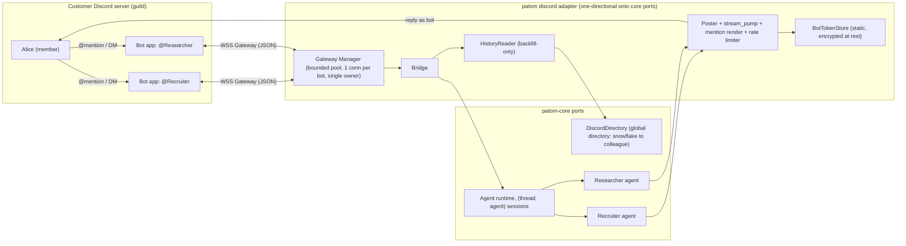
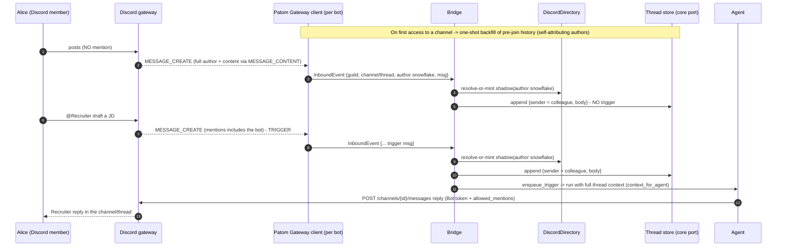
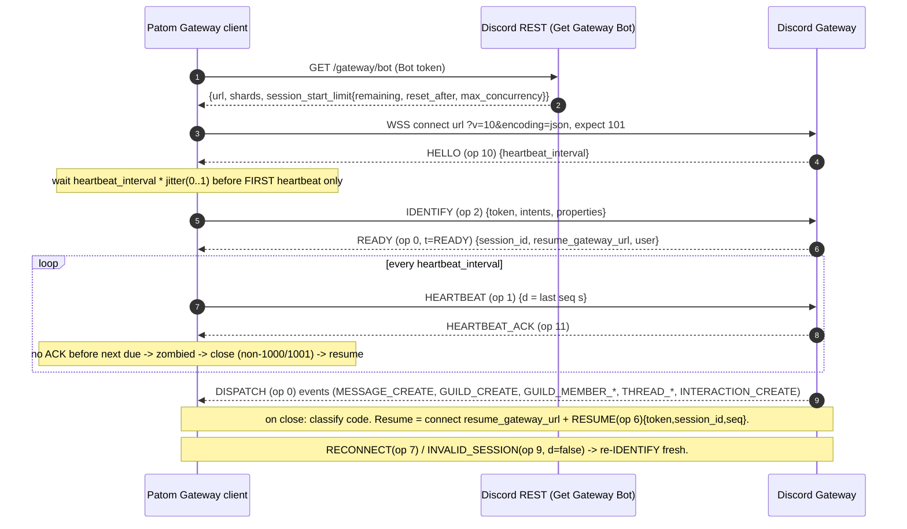
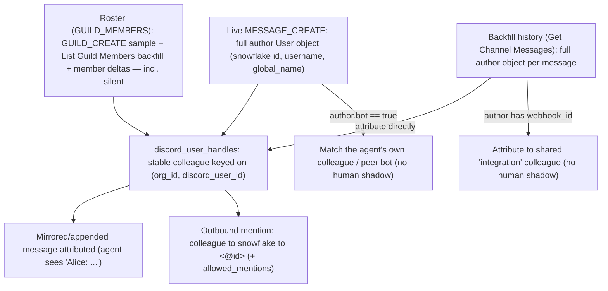
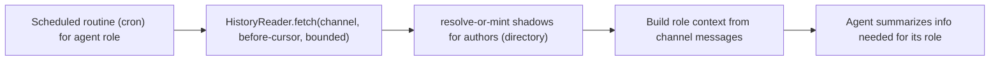
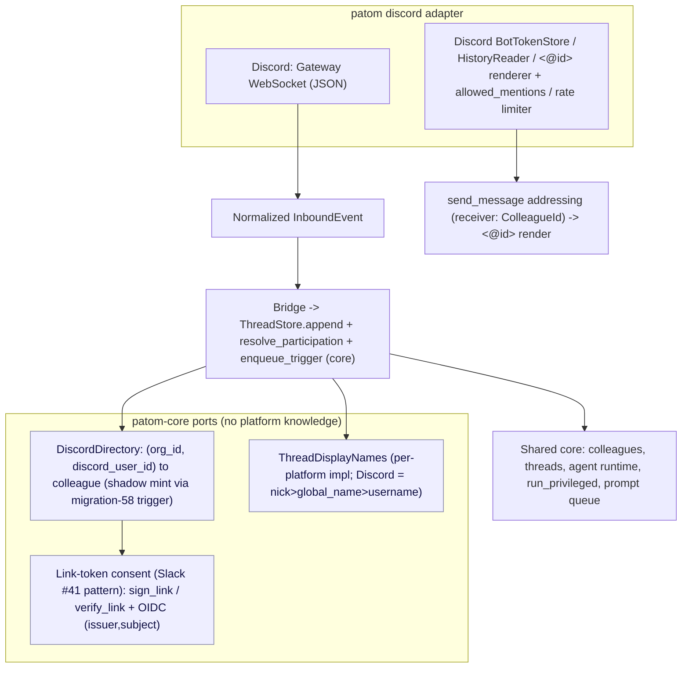
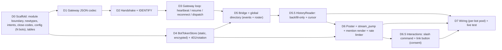
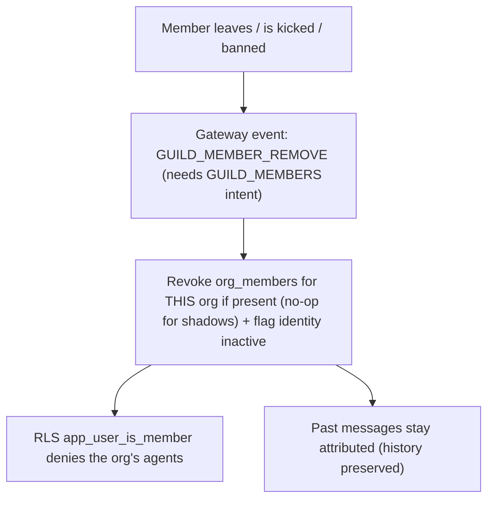

# Patom → Discord (BYO-bot) integration — design & diagrams

> Status: **planning / experiment** (no code yet). Bringing Patom agents into Discord via customer-owned "bring-your-own" bots over Discord's **Gateway** (WebSocket) transport. Authored 2026-06-16. Discord facts re-verified against the official developer docs (`discord.com/developers/docs`) by an adversarial review pass; Patom facts re-verified against the shipped code. Companion to [`lark-byo-integration-plan.md`](lark-byo-integration-plan.md) — same product, same principles, different platform.
>
> **Principles (unchanged from Lark):** (1) **single path** — no optional fast-paths/branches (deferred ones listed below); (2) **agent quality first** — the agent ingests the *whole* conversation and knows *every* participant as a persistent identity, even those who never mention it; (3) **strict module boundary** — Discord is a **one-directional adapter** onto a small set of neutral **core ports**; `patom-core` never references Discord-specific concepts outside the adapter.

## Why / positioning

Patom is an **integration-first agent platform** ([[integration-first-repositioning]]): members talk to agents inside their existing chat app, with **zero Patom touch**; only an **admin** touches Patom (to register bots and map them to agents). Discord joins Lark (first-class) and Slack (shipped) as a target. Discord is the **"clean" platform** of the three — stable global user ids, no email dependency, a static bot token, and self-attributing history — so it exercises the *generic* seams more than the adapter-specific machinery Lark needed.

## How Discord differs from Lark (orientation, not a rewrite)

Everything in the Lark plan that is **product** carries over verbatim (shadow-mint every sender, ingest-all/trigger-on-mention, mirror through core ports, agent loop reused unchanged). What changes is **platform mechanics** — and almost all the changes make Discord *simpler*:

| Concern | Lark | Discord | Net |
|---|---|---|---|
| Transport | `pbbp2` protobuf long-connection | **Gateway WebSocket, JSON frames** (`{op,d,s,t}`) | simpler codec (serde_json, no protobuf) |
| Token | `tenant_access_token`, expires ~2h, refresh loop | **static bot token**, no expiry, no refresh | drop the whole `TokenProvider` refresh machinery |
| Identity key | `user_id` (tenant-scoped employee_id; hard scope gate) | **global user snowflake** (no tenant scope needed) | one uniform key everywhere |
| History attribution | history returns `open_id` only → roster join | **history embeds the full author object** | no roster-join for backfill |
| Ambient-message gate | scope `im:message.group_msg` | privileged intent **`MESSAGE_CONTENT`** | same shape, different name |
| Consent surface | plain URL link only (cards can't ride long-conn) | **slash command + interactive button** ride the Gateway | richer consent UX possible |
| Outbound safety | `<at>` markup | `<@id>` markup **+ mandatory `allowed_mentions`** | new footgun: accidental `@everyone` |
| Rate limiting | per-call retry/backoff | **per-bucket headers + global 50/s + Cloudflare invalid-request ban** | a real rate limiter is required |

The two genuinely *new* hazards Discord adds (vs. Lark) are the **`allowed_mentions` safety object** and the **Cloudflare invalid-request ban that aggregates across a shared egress IP** — both called out below.

## Module boundary — core ports vs the Discord adapter

The dependency is **strictly one-directional**: `discord → core ports`, never `core → discord`. Mirrors the shipped Lark/Slack boundary.

- **Placement.** In-crate module at `crates/patom-core/src/discord/`, mirroring `crates/patom-core/src/lark/` and `crates/patom-core/src/slack/`. One-directional boundary by discipline (grep-checkable: non-`discord` core code has zero `discord::` references; wiring confined to `app.rs` + `http/routes/mod.rs` + the `AppState.discord` field).
- **Core ports the adapter consumes (all already shipped — none mention "discord"):**
  - `ThreadStore::append` (`threads/traits.rs:187`) — write a mirrored message as a `posted` row; plus `resolve_participation`, `dm_counterpart`, `is_channel_member`, `feed`.
  - the **prompt queue** — `PromptQueue::enqueue_trigger(NewTrigger)` (`runtime/queue.rs:93`), the existing Normal trigger; no new queue kind.
  - the **colleague mint** — the `org_members_mint_colleague` trigger (migration `…58_colleagues.up.sql:92`) fires on an `org_members` INSERT; shadow-mint reuses it exactly as Lark does.
  - `run_privileged` (`auth/mod.rs:235`) — the privileged tx for `users`/`org_members` writes (those tables are REVOKEd from the `patom_app` role).
  - **`send_message` addressing** (`tools/system/send_message.rs`) — `receiver: Option<ColleagueId>`; the three delivery paths (untagged / human / agent) are reused unchanged.
  - **`ThreadDisplayNames`** (`colleagues/overrides.rs:25`) — the one **generic** display-name port; the Discord arm resolves `nick > global_name > username`.
  - the **OIDC `(issuer, subject)` login + link-token consent** pattern from Slack #41 ([[slack-phase2-identity-alt-a]]): `sign_link`/`verify_link`, the `Clock` seam, `/auth/oidc/login?return_to=…`, `upsert_from_oidc`.
- **Everything Discord-specific stays inside the adapter:** the Gateway JSON codec, the connection/heartbeat/resume loop, the intents bitfield, the static bot-token store, the `HistoryReader`, the snowflake↔colleague directory, `<@id>` rendering + `allowed_mentions`, the rate limiter, and the Discord-owned tables (`discord_apps`, `discord_user_handles`, `discord_threads`, `discord_message_id`).
- **Wiring** happens only at the composition root (`app.rs` `build_server`), the one place allowed to know both core and Discord.

> Like Lark, mention rendering is **adapter-local** (a directory lookup + markup), not a new core port. The only *generic* port the adapter feeds is `ThreadDisplayNames`. The Lark plan's hypothetical `PlatformMentionRenderer`/`ConsentProof::PlatformControl` ports shipped as adapter-local code — Discord follows that real precedent.

## Core model

- **Transport:** Discord **Gateway** (`wss`, `?v=10&encoding=json`), JSON envelopes `{op, d, s, t}`. No public webhook URL; the connection is authenticated by the bot token in the `IDENTIFY` (opcode 2) payload. Verified against `discord.com/developers/events/gateway`.
- **Topology:** **multi-BYO-bot** — one Discord **Application (bot) per agent** (one app = one bot identity), native `@AgentName`/DM. Admin creates each app and installs it into the guild; no marketplace review at small scale.
- **Tokens:** a **static bot token** per app (`Authorization: Bot <token>` for REST, `token` field at `IDENTIFY`). It **does not expire and needs no refresh** — but it *can* be reset in the portal or invalidated on leak, so the adapter needs a **rotation path + 401 handling**, not a refresh cron. (Contrast: Lark's 2-hour `tenant_access_token`.)
- **Ingest ≠ trigger, and live ingest is event-driven.** With the `GUILD_MESSAGES` + `DIRECT_MESSAGES` + **`MESSAGE_CONTENT`** intents, the bot is delivered every guild/DM message as a `MESSAGE_CREATE` event **with full text**. So the agent **ingests every live message** for context + identity; only a **mention** (or DM) **triggers** a run. **History is pulled only for backfill** — messages before the bot joined the channel, which no event can reach.
  - **The `MESSAGE_CONTENT` gate is load-bearing** (the Discord analogue of Lark `im:message.group_msg`): *without* it, `MESSAGE_CREATE` still arrives but `content`/`embeds`/`attachments`/`components`/`poll` are **empty** — *except* for the bot's own messages, DMs to the bot, and messages that **@mention** the bot. So a **mention/DM-only MVP runs before the intent is approved**; full ambient ingest requires it. Treat empty content on a non-exempt message as **"intent not granted"** (a config state with an admin warning), never as "empty message."
- **Persistent global people directory.** `discord_user_handles(org_id, discord_user_id) → colleague` is the durable map: **one stable Patom identity per Discord user per org**, the same across every channel and thread. **Every observed sender** (not just mention-senders) is materialized here as a **shadow** identity. Because the snowflake is **global** (not tenant-scoped), the key is uniform across events, history, and roster — no satellite handle, no scope gymnastics.
- **Where identity comes from (one uniform key — the user snowflake):**
  - **Live `MESSAGE_CREATE` carries the full author User object** (`id`, `username`, `global_name`) — the author is part of the envelope and is present **even without `MESSAGE_CONTENT`**. Primary identity source for anyone who posts.
  - **Roster (`GUILD_MEMBERS` privileged intent) builds the directory for *silent* members.** On `GUILD_CREATE` (connect-time sample) + a bounded backfill (`GET /guilds/{id}/members`, `after` cursor, `limit≤1000`) or the gateway `REQUEST_GUILD_MEMBERS` op (8), then refreshed by `GUILD_MEMBER_ADD/UPDATE/REMOVE`. Each member object embeds the full user object — so silent members get a stable colleague too.
  - **Backfill history self-attributes.** `GET /channels/{id}/messages` embeds the full author object per message → mirror directly into `thread_messages`, no roster join. **Caveat:** webhook-authored messages carry the *webhook's* id, not a user — detect via the message's `webhook_id` and attribute to a shared "integration" colleague rather than minting a human shadow.
- **Shadow model (identical to Lark):** synthetic email (`discord-{user_id}@shadow.invalid`) on the `users` row + an `org_members` row to mint the attribution colleague via the migration-58 trigger. The shadow has **no exercisable authority** — not because of its role (a real `member`) but because the synthetic user has **no `user_identities` row** and can never authenticate. **Reject "real-email-adopt".** Filter `bot=true` authors and `webhook_id` messages out of the human-mint path.
- **Thread-mirroring adapter (key boundary).** The adapter's only job is to keep the Patom thread a faithful copy of the Discord channel/thread, **writing through core ports only**:
  - **Live messages** arrive as `MESSAGE_CREATE` and are **appended** to `thread_messages` as `posted` rows (correct `sender_colleague_id`) via `ThreadStore::append`.
  - **Backfill** (pre-join) messages are mirrored from history into the same `posted` rows.
  - **Agent execution is reused unchanged** — the loop auto-loads the full thread feed, so a mirrored message is indistinguishable from a natively-typed one. The adapter **writes messages, never touches agent execution.**
- **Thread binding key.** A Discord **thread *is* a channel** (same `POST /channels/{id}/messages` endpoint), so the Patom thread binds to a **single container snowflake** — the channel id for a top-level channel, the thread id for a thread — under a composite `(guild_id, container_id)`. `guild_id` is the org/tenant anchor; `parent_id` is recorded as enrichment. No thread-vs-channel branching at the post seam.
- **Attribution & context:** every mirrored message carries its `sender_colleague_id`; the existing `context_for_agent` renders the flat "who said what" feed — full-thread ingest + shadows-for-all gives the agent human-like awareness automatically. (Context-window bounding stays unbounded for now — handled later by compaction.)
- **Linking / consent:** OIDC login resolves by `(issuer, subject)` via `upsert_from_oidc`. Shadow → real merge is keyed on the Discord user snowflake, authorized by a **signed link-token** (the Slack #41 pattern). **Discord adds a real consent UX**: a `/patom link` slash command and an interactive **button** ride the Gateway as `INTERACTION_CREATE`. Recommended surface = a **Link-style button (style 5)** whose `url` embeds the link-token and points at `/api/discord/identity/start` → `/auth/oidc/login` → `/api/discord/identity/complete` (mirrors Slack's "Set up Patom" button).
- **Generic core ports keep the platform adaptable;** Discord is the third adapter, reusing the same shipped seams.

## Deferred for simplicity

Postponed without hurting the core ("agent ingests the whole thread, knows every participant, replies attributed"):

- **Verified-email merge fast-path** → link-token consent only (Discord carries no email in the Gateway anyway).
- **Merge Case B** (consolidating a pre-existing colleague) → support only the one-UPDATE Case A (as Lark).
- **Account merge + offboarding deprovisioning** → [§9](#9-post-experiment-deferred).
- **Per-person profile/memory** → a future feature; the directory is its anchor, but no memory work here.
- **Context-window bounding** → accepted unbounded; handled by the planned compaction feature.
- **Sharding** → a single shard per bot (the experiment targets a handful of guilds per agent; Discord requires sharding only at ≥2500 guilds). Pre-design the `IDENTIFY` `shard` field so multi-shard is a config change, not a rewrite.
- **`GUILD_PRESENCES` intent** → not requested. An agent platform never needs online/offline status; leaving it off minimizes privileged-data exposure and review burden.
- **Archived-thread deep backfill** → on first access, sweep *active* threads (`GET /guilds/{id}/threads/active`) only; archived-thread history is Phase 2.

(Note: the **member roster is CORE**, not deferred — it builds silent-member identity. The only genuine Phase-2 items: scheduled channel-read and archived-thread backfill.)

---

## 1. Topology — multi-BYO-bot (one Discord application per agent)



## 2. Inbound runtime flow — events ingest live; mention triggers; history backfills on access



`MESSAGE_CREATE` is gated by `GUILD_MESSAGES` (1<<9) / `DIRECT_MESSAGES` (1<<12); `MESSAGE_CONTENT` (1<<15) is what fills the text. The bot's own replies arrive back as `MESSAGE_CREATE` from the bot user — dedup them by the recorded sent `message_id` (and `author.id == bot id`), never re-mirror or re-trigger.

## 3. Gateway lifecycle (the verified protocol)



> **Opcodes (verified):** Dispatch=0, Heartbeat=1, Identify=2, Resume=6, Reconnect=7, Request Guild Members=8, Invalid Session=9, Hello=10, Heartbeat ACK=11.
>
> **Close-code classification (load-bearing — model as a typed enum, never bare ints):**
> - **Reconnectable** (backoff + resume/re-identify): 4000, 4001, 4002, 4003, 4005, 4007, 4008, 4009.
> - **FATAL — do NOT reconnect** (surface a typed admin error, stop the loop): 4004 auth failed (bad token), 4010 invalid shard, 4011 sharding required, 4012 invalid API version, 4013 **invalid intents** (miscalculated bitmask), 4014 **disallowed intents** (privileged intent not enabled/approved in the portal).
>
> A reconnect loop on 4013/4014 hammers the Gateway forever — the fix is to correct the bitmask or enable the intent, not to retry. `4014` is the Discord equivalent of the Slack "agent posts but hears nothing" footgun ([[slack-thread-continuation-public-only]]): the bot connects to REST fine but the Gateway refuses the privileged intent.
>
> **Session limits (encode in `limits.rs`):** 1000 `IDENTIFY`/24h across shards; 120 gateway commands / 60s / connection; concurrent `IDENTIFY` bucketed by `shard_id % max_concurrency`; control payloads < 4096 bytes.

## 4. The persistent global people directory

Every sender we ever ingest becomes one stable Patom identity per org — so the agent knows *who* everyone is across all channels. Discord's uniform global snowflake means **one key for all three sources** (no Lark-style `user_id`/`open_id` split).



## 5. Agent context — live ingest + backfill (core) + channel reading (Phase 2)

**Ingest-all (live via `MESSAGE_CREATE`), trigger-on-mention.** Worked example (your channel), with `MESSAGE_CONTENT` granted:

| # | event in Discord | bot receives? | what Patom does |
|---|---|---|---|
| 0 | (bot installed / first sees the channel) | `GUILD_CREATE` + roster | roster sync (all members) + one-shot **backfill** of pre-join history |
| 1 | A posts (no mention) | **yes (full content)** | append `posted` row → **shadow for A**; no trigger |
| 2 | B posts (no mention) | **yes** | append `posted` row → **shadow for B**; no trigger |
| 3 | **B @-mentions agent** | **yes (trigger)** | append → agent runs with **all** prior context |
| 4 | B posts (no mention) | **yes** | append; no trigger |
| 5 | **B re-mentions** | **yes (trigger)** | append → agent runs with new + prior |

One **uniform** live path (DM = same path, fewer messages, and DMs deliver content even without `MESSAGE_CONTENT`). The shared **`HistoryReader`** primitive is reserved for the two non-event cases:

- **Backfill on first access (core):** `GET /channels/{id}/messages` paged with a `before` cursor (newest→oldest), `limit ≤ 100`, bounded by `MAX_BACKFILL_MESSAGES`; dedup by Discord `message_id`; sets the per-thread cursor. Authors self-attribute (webhook rows degrade to the shared "integration" colleague). Requires `VIEW_CHANNEL` + `READ_MESSAGE_HISTORY` — without the latter the endpoint returns an **empty array silently**, so assert the permission rather than treating an unreadable channel as empty.
- **Proactive channel summarization (Phase 2):** same primitive over a window, triggered by a **scheduled run** — the agent reads the channel and summarizes the info needed for its role.



Requirements (same discipline as Lark):

- **Idempotent** mirror keyed on Discord `message_id` via a dedicated **`discord_message_id`** column/side-map — **not** `thread_messages.idempotency_key` (that's the web optimistic-reconcile key).
- **Bot-message-aware:** the bot's own replies arrive back as `MESSAGE_CREATE`; recognize them by `author.id == bot user id` + the recorded sent `message_id` → match the existing agent row, never a shadow, never a re-trigger.
- **Sender → colleague** per row: human author → shadow colleague; the bot's own app → the agent colleague; `webhook_id` present → shared "integration" colleague; `author.bot == true` (a peer bot) → matched/agent row, not a human shadow.
- **Ordering** by snowflake (snowflakes embed a creation timestamp, monotonic) → thread `seq`, interleaving correctly with the agent's own replies.
- **Threads:** subscribe `GUILDS` (1<<0, non-privileged) to receive `THREAD_CREATE/UPDATE/DELETE/LIST_SYNC`; `GUILD_CREATE` and `THREAD_LIST_SYNC` enumerate only **active** threads — archived threads are silent and need a Phase-2 REST sweep. Idempotent upsert keyed by container id; `THREAD_DELETE` delivers only a partial object (`id, guild_id, parent_id, type`), so tombstone by id alone.

## 6. BYO bot setup — admin-only, with live validation

```mermaid
sequenceDiagram
  autonumber
  participant AD as Customer admin
  participant P as Patom (wizard)
  participant DP as Discord Developer Portal
  participant SRV as Discord server

  AD->>P: Add agent bot, pick agent (Recruiter)
  P-->>AD: agent name + avatar + intent list + per-bot steps
  AD->>DP: Create App (Bot enabled by default); Reset Token (shown once)
  AD->>DP: Bot page -> enable Privileged Intents: MESSAGE_CONTENT + SERVER MEMBERS
  AD->>DP: leave "Interactions Endpoint URL" BLANK (so interactions ride the Gateway)
  AD->>DP: Installation -> Default Install = Guild Install, scopes bot + applications.commands, permissions (Send Messages, Read History, View Channels)
  AD->>SRV: open Install Link, choose server, Authorize (needs Manage Server)
  AD->>P: paste Application ID + Bot Token, map to agent
  P->>P: GET /gateway/bot with token -> Credentials valid
  P->>P: open Gateway, IDENTIFY(intents) -> Connected (no 4004/4014)
  P->>P: first MESSAGE_CREATE with non-empty content -> Live (MESSAGE_CONTENT confirmed)
  P->>DP: register slash commands (/patom) via REST (guild-scoped = instant)
  Note over P,AD: live status ladder; a missing intent (4014) or empty content is named explicitly
```

**Intents (the default Patom set; bitfield in `IDENTIFY`, also toggled in the portal):**

- `GUILDS` (1<<0 = 1) — channel/thread topology + thread events. Non-privileged.
- `GUILD_MESSAGES` (1<<9 = 512) + `DIRECT_MESSAGES` (1<<12 = 4096) — deliver `MESSAGE_CREATE` in guilds **and** DMs (two independent toggles; one does not cover the other). Non-privileged.
- **`MESSAGE_CONTENT`** (1<<15 = 32768) — **privileged**; fills message text. The ambient-ingest gate.
- **`GUILD_MEMBERS`** (1<<1 = 2) — **privileged**; roster of silent members + `GUILD_MEMBER_ADD/UPDATE/REMOVE`.
- **Not** `GUILD_PRESENCES` (1<<8) — deferred; never needed for an agent.

> **Privileged-intent enablement (verified, corrected):** the self-serve gate is **fewer than 10,000 unique users** — under that, the admin just **toggles the intent on in the Developer Portal**, no Discord review. (The old "<100 guilds" rule is **obsolete**; 100 guilds now triggers only *app verification*, a separate process.) At 10k+ users the app must **apply** for privileged-intent access (90-day window; it can keep joining servers during review). For the BYO model — each tenant brings its own small app — this is a per-app portal toggle and fits the admin-only onboarding. The intent must agree in **two places** (portal toggle **and** `IDENTIFY` bitfield) or the Gateway closes with 4014; a running bot won't pick up a portal change until it reconnects.

## 7. The generic core ports (so the platform stays adaptable)

The core exposes neutral ports; **Discord is the third adapter** (Slack + Lark shipped). No new core port is required — Discord reuses what exists.



Discord key mapping:

| platform | scope_id | external_id (identity key) | consent proof |
|---|---|---|---|
| **Discord** | `guild_id` (→ org) | **user snowflake** (global; no tenant scope) | signed link-token via slash-command + Link-style button |

> Discord is the directory's *easy* case: a stable, global, top-level snowflake; no email; full author objects everywhere. (Two doc-grounded nuances to honor in code: the snowflake is "guaranteed unique except where child objects share a parent id" — not an issue for user ids — and "stable forever" is an *operational* assumption, not a documented guarantee. Key on the snowflake regardless; never key on `username`/`global_name`, which change.)

## 8. Experiment build plan (multi-bot, full-thread context from the start)



- **D0** Scaffold the adapter (`crates/patom-core/src/discord/`): newtypes, each `TryFrom` at the boundary (§1) — `DiscordUserId(u64)` and `DiscordSnowflake` (**parsed from a JSON *string*** — a 53-bit JS-`Number`/`f64` path corrupts the id, so parse `&str → u64`), `GuildId`, `ContainerId` (channel **or** thread; same post path), `ApplicationId`, `DiscordMessageId`, `BotToken(SecretString)`; an `Intents` bitfield newtype built from named flags (a miscalculated mask = close 4013, so make it unconstructible by hand); a `CloseCode` sum type splitting fatal vs reconnectable; a `ChannelType` enum (0/1/3/5/10/11/12/15/16 …) with exhaustive `match`; `DiscordError` (one `thiserror` enum — §12); `limits.rs`; `DiscordBotConfig` (N bots). Tables: `discord_apps`, `discord_user_handles`, `discord_threads`, `discord_message_id`. **No new core port** — reuse `ThreadDisplayNames`.
- **D1** Gateway JSON codec — `{op, d, s, t}` envelope via `serde` at the boundary (§1), opcode enum, close-code classification. No protobuf (the simplification over Lark's pbbp2). ~100% coverage.
- **D2** Handshake: `GET /gateway/bot`, connect `wss …?v=10&encoding=json`, `HELLO` → `IDENTIFY{token, intents, properties}` → `READY{session_id, resume_gateway_url}`, error mapping, timeout (§5).
- **D3** Gateway loop: heartbeat (**only the first is jittered**; track `HEARTBEAT_ACK`, zombie-detect on a miss → close non-1000 → resume), `RESUME` (op 6) to `resume_gateway_url` vs re-`IDENTIFY` on `INVALID_SESSION{d=false}`, handle `RECONNECT` (op 7), **classify close codes** (fatal 4004/4010-4014 stop; others backoff-reconnect with a finite cap, §5), tasks under `JoinSet` (§7). Dispatch `MESSAGE_CREATE`, `GUILD_CREATE`, `GUILD_MEMBER_*`, `THREAD_*`, `INTERACTION_CREATE`.
- **D4** `BotTokenStore`: store the static token encrypted at rest via `OrgEncryptor` (`crypto/mod.rs:81`, AES-256-GCM + per-org HKDF KEK — same as Lark's `app_secret`). **No refresh loop.** Handle a 401 (reset/leaked token) by surfacing a typed re-credential error + an admin rotation path, `Clock`-driven where time appears (§11).
- **D5** Bridge + **global directory**: `MESSAGE_CREATE` author (full object) → `resolve_or_mint` shadow (filter `bot=true` + `webhook_id`); roster from `GUILD_CREATE` sample + bounded `List Guild Members` (`after` cursor, `limit≤1000`) or gateway op-8, refreshed by `GUILD_MEMBER_ADD/UPDATE/REMOVE`; `discord_user_handles(org_id, discord_user_id)`; idempotency `discord:{guild_id}:{message_id}`; `discord_threads` binding + cursor. **Reuse the migration-58 mint trigger** via an `org_members` INSERT inside `run_privileged` — identical to `lark/directory.rs`. **Prefer member-delta events over re-running op-8** (a new Oct-2025 rate limit caps "request all members"; a `RATE_LIMITED` gateway event is an *operating* error, retry/backoff — not an assertion, §6).
- **D5.5** `HistoryReader`: **backfill-only** (one-shot on first channel access) + incremental cursor for the scheduled Phase-2 read; `GET /channels/{id}/messages` with a `before` cursor (`limit≤100`, bounded `MAX_BACKFILL_MESSAGES`); self-attributing authors (webhook rows → shared "integration" colleague); dedup by `message_id` (`discord_message_id`). Active-thread sweep via `GET /guilds/{id}/threads/active`; archived-thread history deferred.
- **D6** Poster + stream_pump + **mention render** + **rate limiter**: reply via `POST /channels/{container_id}/messages` (same endpoint for channel **and** thread); **every send carries an explicit `allowed_mentions`** — default `{parse: []}`, widening only to the specific user/role ids the agent deliberately targeted (the structural defense against accidental `@everyone` when echoing text; model `AllowedMentions` as a newtype that **cannot be constructed unset**); `colleague → <@snowflake>` rendering driven by the directory; replies via `message_reference` with `fail_if_not_exists: false` (so scheduled delivery against a since-deleted message degrades to a plain post, the OutboundRouter "scheduled task ran, nothing posted" fix from [[agent-channel-dm-addressing]]); chunk output to the **2000-char** cap (`DISCORD_MESSAGE_MAX` in `limits.rs`); record each sent `message_id` for dedup. **Rate limiter** sized at startup (§9): a token bucket keyed on **`(bot_token, bucket-hash, major-resource)`** (per-route buckets are keyed by the `X-RateLimit-Bucket` hash **plus** the major resource — two channels can share a hash yet have independent quotas) **plus** a per-token global ~50/s; parse `X-RateLimit-Reset-After` as a **float** and wait proactively; honor 429 `retry_after` (float) into a **bounded** backoff (§5). **Guard the invalid-request budget**: >10,000 `401/403/429` in 10 min = a **Cloudflare IP ban that aggregates across every tenant bot on the shared egress IP** — so one noisy tenant can take down all of them; add a per-egress-IP invalid-rate gauge + per-bucket saturation counters (§2). OTel: `patom.discord.ratelimit.429{scope,global}`.
- **D6.5** Interactions (consent + control plane): register the `/patom` slash command set per bot via REST (**guild-scoped = instant** for test, global = eventually-consistent for prod) — an idempotent reconcile, control-plane/admin-only. Receive `INTERACTION_CREATE` **over the same Gateway socket** (no public inbound HTTP); **respond within 3 s via an outbound `POST /interactions/{id}/{token}/callback`** (defer with type 5/6 if slow; token valid 15 min; `EPHEMERAL` flag = 64). Consent surface = a **Link-style button (style 5)** whose `url` embeds the signed link-token (sidesteps the 100-char `custom_id` limit + the 3 s deadline) → `/api/discord/identity/start` → `/auth/oidc/login` → `/api/discord/identity/complete`. **Assert at startup the BYO bot has no "Interactions Endpoint URL" configured** (else interactions silently never reach the gateway — the Discord "agent posts but hears nothing" failure mode).
- **D7** Wiring (mirrors the Lark template exactly): Gateway manager over the per-bot pool (bounded `JoinSet` + idle eviction; **single owner per bot** via a `pg_try_advisory_lock` so a 2nd replica doesn't also `IDENTIFY` — Discord's 1000-`IDENTIFY`/24h limit punishes duplicate connects); admin routes `POST /api/discord/apps` (register + hot-connect), `GET /api/discord/apps`, `DELETE /api/discord/apps/{app_id}` (disconnect), gated `require_admin` (Owner/Admin); `OrgEncryptor` for the token at rest; `DiscordAppState{apps, stream_pump, gateway_manager}`; config `PATOM_DISCORD_ENABLED` → `Option<DiscordSettings>{api_base, public_base_url}`; `app.rs build_server` builds iff `settings.discord.is_some()`, sets `AppState.discord`; `routes/mod.rs` `.merge(discord::admin_routes::private_router())`; shutdown ordering `gateway_manager → bridge → pump`. Live test in a real Discord server.

## 9. Post-experiment (deferred)

### 9a. Reused capability (NOT new) — delegation, anchored on the directory

The persistent directory (built in the experiment) lights up delegation, which Patom already has:

- **Delegation addressing — already exists** (`send_message(receiver: ColleagueId)`). The Discord-side addition is the **outbound mention render in the poster** (D6) — `colleague → <@snowflake>` with `allowed_mentions` listing the addressed id. The addressing primitive is reused; the markup is new (and *simpler* than Lark's `<at>`, with no app-scoped-id problem — a snowflake is global). So delegation works **in the experiment**.

(Per-person memory is a **future feature enhancement**, out of scope here — see Deferred.)

**Genuine Phase-2 items: scheduled channel-read ([§5](#5-agent-context--live-ingest--backfill-core--channel-reading-phase-2)) and archived-thread backfill.**

### 9b. Shadow → real account merge

Runs only when a shadow person also becomes a real Patom user. Consent via the link-token (Slack #41), but Discord lets it be a **real interactive flow** rather than a bare URL.

```mermaid
sequenceDiagram
  autonumber
  participant A as Alice (was a shadow)
  participant Bot as Discord bot
  participant P as Patom
  participant DB as Patom DB
  A->>Bot: runs /patom link (INTERACTION_CREATE over the Gateway)
  Bot->>P: request link token for (guild_id, discord_user_id)
  P-->>Bot: signed link-token (expiring, ~10 min)
  Bot-->>A: ephemeral reply with a Link-style button (url embeds the token)
  A->>P: click -> /api/discord/identity/start (verifies token) -> /auth/oidc/login
  alt not signed in
    P->>A: OIDC login (Google)
    A-->>P: real account U_real (issuer, subject) via upsert_from_oidc
  end
  P->>P: /api/discord/identity/complete re-verifies token = consent proof
  P->>DB: link discord_user_handles -> U_real; re-point colleague from U_shadow to U_real; retire shadow; audit
  P-->>A: linked - Discord history now under your account
```

Mechanics are identical to Lark: `thread_messages.sender_colleague_id` points at a *colleague*, so one privileged UPDATE re-backs the colleague — all history follows, no message rewrite. Statement **ordering is load-bearing** (re-point the colleague *before* the `org_members` INSERT so the mint trigger's `ON CONFLICT DO NOTHING` no-ops), and the writes run via `run_privileged`. (Case B — a pre-existing colleague for `U_real` — is deferred.)

### 9c. Offboarding / deprovisioning

Single idempotent action on the Discord member-removed event:



Revoke membership, **never** delete the global `users` row or history.

## Open items to verify during build

- **Confirmed:** without `MESSAGE_CONTENT`, `MESSAGE_CREATE` still arrives but `content`/`embeds`/`attachments`/`components`/`poll` are empty — except the bot's own messages, DMs to the bot, and @mentions of the bot (also message-context-menu targets). So a mention/DM-only MVP works pre-approval; ambient ingest needs the intent.
- **Confirmed (corrected):** the privileged-intent self-enable gate is **< 10,000 users** (portal toggle, no review), **not** "< 100 guilds." 100 guilds triggers only app *verification*. Document the toggle as a required admin step; a verified app at 10k+ users must apply for the intent.
- **Confirmed:** `INTERACTION_CREATE` (slash commands **and** button clicks) rides the Gateway **by default** and is **not gated by any intent**; setting an "Interactions Endpoint URL" flips delivery to HTTP+Ed25519 (mutually exclusive). Leave the URL **unset**. Responses still go out over HTTP within 3 s (defer if slow).
- **Confirmed:** `GET /channels/{id}/messages` embeds the **full author User object** per message → backfill self-attributes with no roster join. **Caveat:** webhook messages carry the *webhook's* id (`webhook_id` present) — branch and degrade to a shared "integration" colleague.
- **Confirmed:** the bot token is **static** (no expiry/refresh) but resettable/leak-invalidated → build a rotation path + 401 handling, not a refresh cron.
- **Confirmed:** `GUILD_MEMBERS` (privileged) is required for member events + the full roster (REST `List Guild Members` *and* gateway op-8 `query=""`+`limit=0`). The new (Oct-2025) op-8 rate limit means: do one bounded initial sync, then keep the roster warm via member-delta events.
- **Confirmed:** rate limits = per-`(bucket-hash + major-resource)` headers (`Reset-After` is a **float**) + global ~50/s **per token**; > 10,000 invalid (`401/403/429`) per 10 min = a **per-IP Cloudflare ban** (`shared`-scope 429s exempt). On a shared egress, one tenant's bug bans everyone → per-IP invalid-rate monitoring + isolation.
- **Verify on a real server:** that a `<@bot_id>` in `mentions` reliably classifies a "trigger" vs an ambient message, and that the bot's own replies (re-delivered as `MESSAGE_CREATE`) are deduped by recorded `message_id` + `author.id`.
- **Multi-bot ops:** N apps × M guilds = N Gateway connections (one per bot, all its guilds on the one socket) — bounded pool + **single owner per bot** (advisory lock) + finite reconnect + IDENTIFY-budget awareness + saturation/age metrics.
- **Mirror ↔ native parity:** a Discord-mirrored `thread_messages` row must be byte-for-byte the shape the agent loop expects (`kind=posted`, sender colleague, snowflake ordering) so execution is genuinely unchanged.
- **Privileged writes:** shadow-user + `org_members` mint and the merge UPDATE run via `run_privileged`; the consent/merge SQL surfaces typed `DiscordError`/core errors.

---

## Setup & e2e test (follow to test)

### 1. Discord Developer Portal (per bot = per agent)
1. **Create App** (the Bot user is enabled by default). On the **Bot** page, **Reset Token** and copy it (shown once).
2. **Bot → Privileged Gateway Intents:** enable **Message Content Intent** and **Server Members Intent**. (Leave Presence off.)
3. Leave **Interactions Endpoint URL blank** (so slash commands/buttons ride the Gateway).
4. **Installation → Default Install Settings:** Guild Install, scopes **`bot`** + **`applications.commands`**, permissions **Send Messages + Read Message History + View Channels**. Copy the **Install Link**.
5. Open the Install Link, pick the server, **Authorize** (the installer needs **Manage Server**).
6. Copy the **Application ID** (= `client_id`) and the **Bot Token**.

> Footgun ladder: a wrong/blank token → Gateway close **4004**; a privileged intent toggled in code but not the portal → close **4014**; the intent on but content still empty → you're hitting a non-exempt message without `MESSAGE_CONTENT` approval. An **Interactions Endpoint URL accidentally set** → slash commands/buttons never reach the bot.

### 2. Patom config + bot registration
```bash
# .env
PATOM_DISCORD_ENABLED=true
PATOM_DISCORD_API_BASE=https://discord.com/api/v10
```
Then register the bot → agent mapping (admin, signed-in member). `agent_id` is a Patom agent uuid; the bot token is encrypted at rest (`OrgEncryptor`):
```bash
# State-changing POST in the auth subtree → needs the login cookie AND the
# double-submit CSRF token (patom_csrf cookie + matching X-CSRF-Token header):
curl -i -X POST "$PATOM/api/discord/apps" -H 'content-type: application/json' \
  -H "X-CSRF-Token: $CSRF" -H "Cookie: patom_session=$SESSION; patom_csrf=$CSRF" \
  -d '{"application_id":"123…","bot_token":"MTk4…","agent_id":"<patom-agent-uuid>"}'
# GET /api/discord/apps → list (safe, no CSRF) ; DELETE /api/discord/apps/{application_id} → remove
```

### 3. Run + validate (status ladder)
Start Patom (`cargo run --bin patom`). The Gateway manager opens one connection per registered bot. Validate:
- **credentials** — `GET /gateway/bot` succeeds (no `discord.gateway.token_invalid`);
- **connected** — `HELLO` + `IDENTIFY` + `READY` (no close 4004/4014);
- **live** — first `MESSAGE_CREATE` with **non-empty content** (confirms `MESSAGE_CONTENT`);
- **mention** — `@`-mention the bot in a channel, or DM it → `discord.bridge.enqueued`;
- **reply** — the agent's answer posts back in the channel/thread (with a safe `allowed_mentions`);
- **consent** — `/patom link` → ephemeral reply with a button → login → identity linked.

Ambient (non-mention) messages are ingested into the thread so the agent sees the whole conversation on the next mention.

### 4. Local automated test (no network / portal)
```bash
docker compose up -d postgres
cargo test -p patom-core --test discord_e2e          # ambient ingest path (fake gateway feed)
```
Plus the unit suites: `cargo test -p patom-core --lib discord::` (JSON codec, heartbeat/resume state machine, close-code classification, directory shadow-mint, mention render + `allowed_mentions`, rate-limiter bucket keying, poster). Tests own the clock (§11): `#[tokio::test(start_paused = true)]` for the heartbeat/reconnect timers, `Arc<TestClock>` for the link-token expiry.
