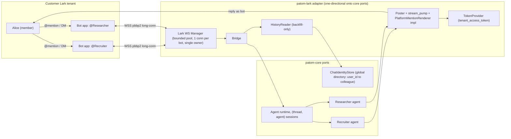
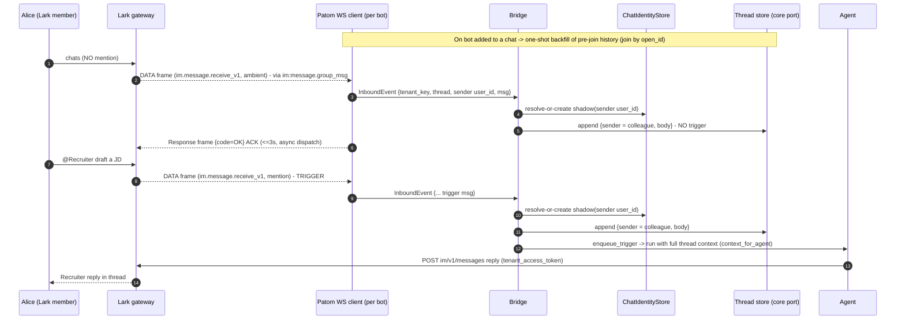
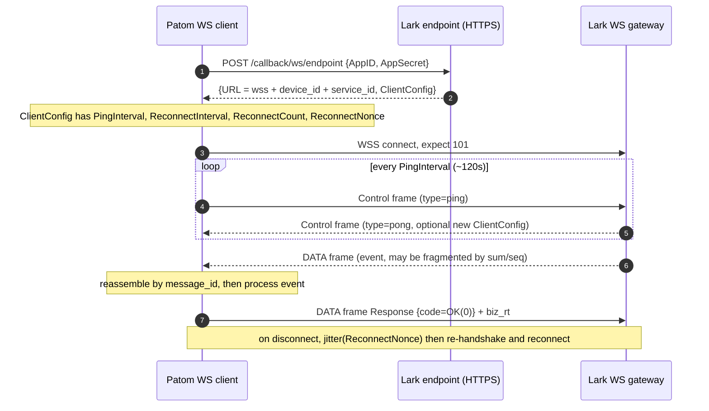
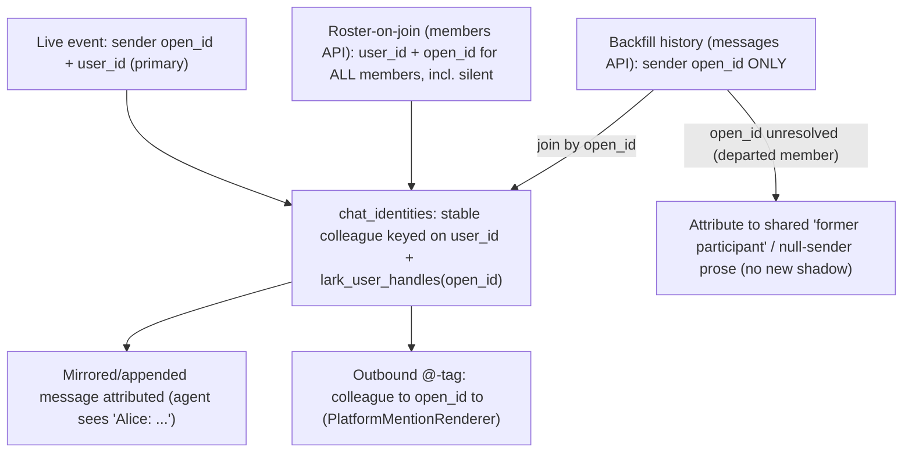
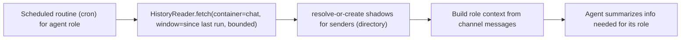
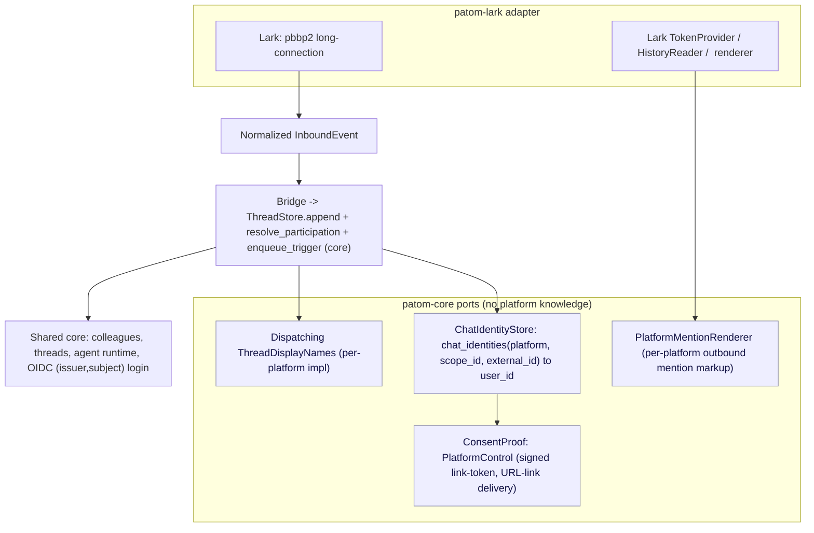
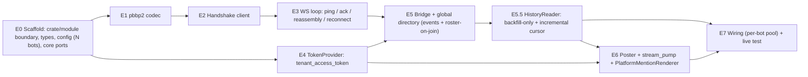
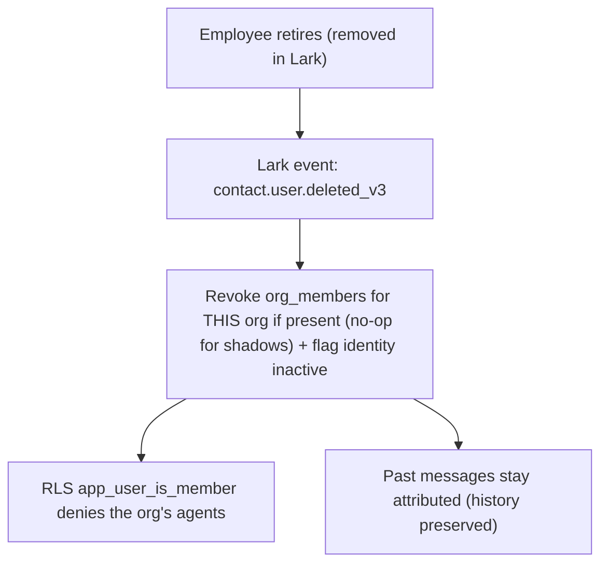

# Patom → Lark (BYO-bot) integration — design & diagrams

> Status: **planning / experiment** (no code yet). Bringing Patom agents into Lark via customer-owned "bring-your-own" bots over Lark's long-connection (WebSocket) transport. Authored 2026-06-15. Revised 2026-06-15 after a deep review (Lark claims re-verified against official docs; Patom claims re-verified against the codebase).
>
> **Principles:** (1) **single path** — no optional fast-paths/branches (deferred ones listed below); (2) **agent quality first** — the agent ingests the *whole* conversation and knows *every* participant as a persistent identity, even those who never mention it; (3) **strict module boundary** — Lark is a **one-directional adapter** onto a small set of neutral **core ports**; `patom-core` never references Lark. Lark is the **first-class** integration of the re-positioned product; the core stays adaptable so other platforms can be added later, but that is out of scope here.

## Why / positioning

Patom is an **integration-first agent platform**: members talk to agents inside their existing chat app, with **zero Patom touch**; only an **admin** touches Patom (to register bots and map them to agents). **Lark is the first-class target.**

## Module boundary — core ports vs the Lark adapter

The integration must not couple `patom-core` to Lark. The dependency is **strictly one-directional**: `lark → core ports`, never `core → lark`. Concretely:

- **Placement (shipped).** Lark is an **in-crate module** at `crates/patom-core/src/lark/`, mirroring `crates/patom-core/src/slack/`. The one-directional boundary is by discipline (grep-checkable: non-`lark` core code has zero `lark::` references; wiring is confined to `app.rs` + `http/routes/mod.rs` + the `AppState.lark` field). A dedicated `crates/patom-lark/` crate (compiler-enforced) was considered but deferred — the Slack precedent is in-crate, and a crate split would force exposing many `pub(crate)` core types as a public facade.
- **Core ports the adapter consumes (none mention "lark"):**
  - `ThreadStore` — `append` a message, `resolve_participation`, read a thread binding.
  - the **trigger queue** — `enqueue_trigger` (the existing Normal trigger; no new queue kind).
  - `ThreadDisplayNames` — inbound per-platform display-name override (already a core seam).
  - `PlatformMentionRenderer` — **new core port**: outbound `colleague → platform handle → mention markup` (see §E6). Generic; Lark provides the `<at>` impl.
  - `ConsentProof::PlatformControl` — **new core type**: a signed link-token + post-login completion (shadow→real merge).
  - colleague **mint** (`org_members` INSERT → trigger) and **addressing** (`send_message(receiver: ColleagueId)`), both already in core.
- **Everything Lark-specific stays inside the adapter:** pbbp2 codec, WS client, `TokenProvider`, `HistoryReader`, identity mapping, the `<at>` rendering, and the Lark-owned tables (`lark_user_handles`, `lark_threads`, `lark_message_id`).
- **Wiring** happens only at the composition root (`app.rs`), which is the one place allowed to know both core and Lark.

## Core model

- **Transport:** Lark **long-connection (WebSocket)**, `pbbp2` protobuf frames — no public webhook URL, **no per-event AES/signature** (the connection is still authenticated by App ID/Secret at handshake). Verified against `larksuite/oapi-sdk-go` (`ws/`).
- **Topology:** **multi-BYO-bot** — one self-built Lark app per agent (one app = one bot identity), native `@AgentName`/DM. Admin creates the apps; no marketplace review.
- **Tokens:** custom-app `tenant_access_token` from each bot's `app_id`/`app_secret` (`auth/v3/tenant_access_token/internal`). Cache by the response `expire` (~7200s), don't hardcode the TTL.
- **Ingest ≠ trigger, and *live ingest is event-driven*.** With the `im:message.group_msg` scope the bot is **delivered every group message as an event** (mention or not), and DM messages too — each event carries the sender's `user_id` (given the contact scope). So the agent **ingests every live message** for context + identity from events; only a **mention** (or DM) **triggers** a run. **History is pulled only for backfill** — messages that occurred *before the bot joined the chat*, which no event can reach.
- **Persistent global people directory.** `chat_identities(platform, scope_id, external_id) → patom_user` is the durable map: **one stable Patom identity per Lark user per tenant**, the same across every thread and channel. **Every observed sender** (not just mention-senders) is materialized here as a **shadow** identity.
- **Where identity comes from:**
  - **Live events carry `user_id` directly** (sender object includes `user_id` with the contact scope) → the primary identity source for anyone who posts while the bot is present.
  - **Roster-on-join builds the directory for *silent* members.** On `im.chat.member.bot.added_v1` (refreshed by `im.chat.member.user.added_v1`/`deleted_v1`), fetch all members (`member_id_type=user_id` **and** `open_id`, paged ≤100, bounded) → a stable colleague keyed on **`user_id`** + `open_id` in `lark_user_handles`, for **every member, including silent ones who never post.**
  - **Backfill history joins by `open_id`.** The history API (`im/v1/messages`) returns each sender **only as `open_id`** (no `user_id` option), so backfill messages join the directory via the stored `open_id` → colleague → mirror into `thread_messages`.
- **`open_id` = backfill-join key + tag handle.** Because the roster gives `open_id` for **all** members, the agent can `@`-tag **anyone in the channel** (posted or silent): `colleague → open_id → <at user_id="ou_...">name</at>` (Lark `<at>` accepts open_id/union_id/user_id in text & post; open_id is the safe choice; **everyone-tag is `<at id=all></at>`; card @-syntax differs** — `<at id=...>`).
- **Identity key:** **`user_id`** (tenant-scoped == Lark "employee_id"; from events + roster — history can't provide it). `open_id` is a per-bot satellite for backfill joins + tagging. A hard admin-setup gate on the `contact:user.employee_id:readonly` scope makes `user_id` always present for in-tenant members; there is **no open_id-only identity fallback** (see Deferred).
- **Shadow model:** synthetic email (`lark-{user_id}@shadow.invalid`) on the `users` row + a `org_members` row to mint the attribution colleague. The shadow has **no exercisable authority** — not because of its `org_members` role (which is a real `member`), but because the synthetic user has **no login identity** (`user_identities` row); it can never authenticate. **Reject "real-email-adopt".**
- **Thread-mirroring adapter (key boundary).** The adapter's only job is to keep the Patom thread a faithful copy of the Lark thread, **writing through core ports only**:
  - **Live messages** arrive as events and are **appended** to `thread_messages` as normal `posted` rows (correct `sender_colleague_id` per sender) via `ThreadStore.append`.
  - **Backfill** (pre-join) messages are mirrored from history into the same `posted` rows.
  - **Agent execution is reused unchanged** — the agent loop already auto-loads the full thread feed before running, so a mirrored/appended message is indistinguishable from a natively-typed one. The adapter **writes messages, never touches agent execution.**
- **Attribution & context:** every message carries its `sender_colleague_id`; the existing `context_for_agent` renders the flat "who said what" feed — so full-thread ingest + shadows-for-all gives the agent human-like awareness of the whole conversation and everyone in it, automatically. (Context-window bounding is accepted as unbounded for now — see Deferred.)
- **Linking / consent:** OIDC login resolves by `(issuer, subject)`. Shadow → real merge is keyed on the platform id, authorized by a **signed link-token** delivered as a **URL link** (`ConsentProof::PlatformControl`). Card-action buttons are **not** deliverable over the long-connection (events only), so consent uses a plain message link, not an interactive card. No verified-email fast-path.
- **Generic core ports** (`chat_identities` + `ConsentProof::PlatformControl` + dispatching `ThreadDisplayNames` + `PlatformMentionRenderer`) keep the core adaptable; Lark is the only adapter built here.

## Deferred for simplicity

Postponed without hurting the core ("agent ingests the whole thread, knows every participant, replies attributed"):

- **Verified-email merge fast-path** → link-token consent only.
- **`open_id`-only identity fallback** → **removed**, not just deferred. `contact:user.employee_id:readonly` is a hard setup gate, so in-tenant members always carry `user_id`. If a member genuinely has no visible `user_id` at build time, **drop** that member rather than fork the identity key.
- **Merge Case B** (consolidating a pre-existing colleague) → support only the one-UPDATE Case A.
- **Account merge + offboarding deprovisioning** → [§9](#9-post-experiment-deferred).
- **Per-person profile/memory** → a **future feature enhancement**, out of scope for this integration. The directory is its eventual anchor, but no memory work is done here.
- **Context-window bounding** → the full mirror flows unbounded into context today; this is **accepted** and will be handled by the planned **compaction** feature, not in this experiment.

(Note: the **member roster is CORE**, not deferred — it's how silent-member identity is built and how backfill history joins, since the history API can't return `user_id`. The only genuine Phase-2 item: scheduled channel-read.)

---

## 1. Topology — multi-BYO-bot (one self-built app per agent)



## 2. Inbound runtime flow — events ingest live; mention triggers; history backfills on join



## 3. pbbp2 long-connection lifecycle (the verified protocol)



> Codec note: align the WS `Response` code set to pbbp2 (`OK=0`, `Forbidden=403`, `AuthFailed=514`, `ExceedConnLimit=…`) — the success code is **`OK=0`**, not literally `200`.

## 4. The persistent global people directory

Every sender we ever ingest becomes one stable Patom identity per tenant — so the agent knows *who* everyone is across all threads.



## 5. Agent context — live event ingest + backfill (core) + channel reading (Phase 2)

**Ingest-all (live via events), trigger-on-mention.** Worked example (your thread), with `im:message.group_msg`:

| # | event in Lark | bot receives? | what Patom does |
|---|---|---|---|
| 0 | (bot is added to the chat) | event `member.bot.added` | roster sync (all members) + one-shot **backfill** of pre-join history |
| 1 | A chats (no mention) | **yes (ambient event)** | append `posted` row → **shadow for A**; no trigger |
| 2 | B chats (no mention) | **yes (ambient event)** | append `posted` row → **shadow for B**; no trigger |
| 3 | **B @-mentions agent** | **yes (trigger)** | append → agent runs with **all** prior context |
| 4 | B chats (no mention) | **yes (ambient event)** | append; no trigger |
| 5 | **B re-mentions** | **yes (trigger)** | append → agent runs with new + prior |

One **uniform** live path (DM = same path, fewer messages). The bot's own replies are **not** re-delivered as events, so no per-turn re-mirror is needed. The shared **`HistoryReader`** primitive is reserved for the two non-event cases:

- **Backfill on join (core):** `fetch(container=thread|chat, bounded, paged)` once when the bot is added; dedup by Lark `message_id`; sets the per-thread cursor. Backfill senders are `open_id`-only → joined via the roster; the bot's own prior replies appear with `sender_type=app` and are matched to existing agent rows (no duplicate, no shadow for the bot).
- **Proactive channel summarization (Phase 2):** same primitive, `container=chat` over a time window, triggered by a **scheduled run** — the agent reads the channel and summarizes the info needed for its role.



`HistoryReader` and the live append both write each Lark message into `thread_messages` as a normal `posted` row (so agent execution is untouched). Requirements:

- **Idempotent** mirror keyed on Lark `message_id` via a dedicated **`lark_message_id`** column / side-map — **not** `thread_messages.idempotency_key` (that is the web front-end optimistic-reconcile key, a different namespace). Re-sync/backfill never duplicates.
- **Bot-message-aware:** backfill recognizes the agent's own prior replies by `sender_type=app` (and the recorded `lark_message_id` of sent replies) → matches the existing agent row, never a shadow.
- **Sender → colleague** per row: human sender → shadow colleague; the bot's app → the agent colleague; an unresolvable `open_id` (departed member, backfill only) → a shared "former participant" colleague or null-sender prose (the existing read path already degrades unknown senders — no new branch).
- **Ordering** by Lark timestamp/order → thread `seq`, interleaving correctly with the agent's own replies.
- Read scope `im:message.history:readonly`; **`container_id_type=thread` does not support a `start_time`/`end_time` window**, so the incremental cursor is `page_token`/`seq` + `message_id` dedup, not a time range. History `page_size` cap is **50** (the ≤100 cap is the *roster* API). Bounded `MAX_BACKFILL_MESSAGES` + `page_token` pagination; per-thread `last_synced` cursor.

## 6. BYO bot setup — admin-only, with live validation

```mermaid
sequenceDiagram
  autonumber
  participant AD as Customer admin
  participant P as Patom (wizard)
  participant LC as Lark dev console

  AD->>P: Add agent bot, pick agent (Recruiter)
  P-->>AD: agent name + avatar + scope list + per-bot steps
  AD->>LC: create self-built app, enable Bot
  AD->>LC: add scopes (send msg, im:message.history:readonly, im:message.group_msg, im:chat:readonly members, contact:user.employee_id:readonly)
  AD->>LC: Events mode = long connection
  AD->>LC: subscribe events (message.receive_v1, chat.member.*, p2p_chat_create, contact.user.deleted_v3)
  AD->>LC: submit version, admin approval (release)
  AD->>P: paste App ID + App Secret, map to agent
  P->>P: mint tenant_access_token to Credentials valid
  P->>P: open long-connection to Connected
  P->>P: first event received to Live
  Note over P,AD: live status ladder; a missing scope is named explicitly
```

Scopes (confirm the exact granular **send** scope at setup — `im:message` / `im:message:send_as_bot`):

- **Send replies** — `im:message` (or the granular send scope).
- **Backfill history** — `im:message.history:readonly` (least-privilege for the list-messages API).
- **Live ambient group messages** — `im:message.group_msg` (delivers non-mention group messages as events; without it the bot only receives `@`-mentions in groups).
- **List chat members with `user_id`** — `im:chat:readonly`.
- **Resolve `user_id` (employee_id)** — `contact:user.employee_id:readonly` (**hard gate**; the whole identity model collapses without it — there is no `contact:user.id:readonly` scope).

## 7. The generic core ports (so the platform stays adaptable)

The core exposes neutral ports; **Lark is the one adapter built here.** The ports admit other platforms later, but that is out of scope.



Lark key mapping:

| platform | scope_id | external_id (identity key) | consent proof |
|---|---|---|---|
| **Lark** | `tenant_key` | **`user_id`** (== employee_id; `contact:user.employee_id:readonly` required) | signed link-token via URL link |

> The same ports admit future platforms (each supplies its own transport, identity key, and consent proof); none is built here. Note for a future generalization: a fresh `chat_identities` must allow a **late-bound/shadow** user (nullable `user_id`), which a strict `NOT NULL` identity table would not — design `chat_identities` for the shadow case from the start.

## 8. Experiment build plan (multi-bot, full-thread context from the start)



- **E0** Scaffold the adapter (`crates/patom-lark/` preferred): newtypes (`LarkUserId`/`LarkOpenId`/`LarkUnionId`/`TenantKey`/`AppId`/`LarkMessageId`/`LarkChatId`, each `TryFrom` at the boundary — §1), `LarkError` (one `thiserror` enum — §12), `limits.rs`, `LarkBotConfig` (N bots), and the **new core ports** (`PlatformMentionRenderer`, `ConsentProof::PlatformControl`) added to `patom-core` with no Lark references.
- **E1** `pbbp2` codec — hand-rolled encode/decode + reassembly (explicit bounded loop over a `VecDeque`, **no recursion** — §4), bounded cache (§5). ~100% coverage.
- **E2** Handshake client (`/callback/ws/endpoint`, `ClientConfig`, error mapping, timeout).
- **E3** WS loop: connect/receive/ping/ACK(`OK=0`)/pong-reconfigure/reassembly/reconnect (finite `ReconnectCount` — the SDK default is infinite; §5), tasks under `JoinSet` (§7). **3s ACK deadline:** ACK the frame immediately, dispatch the agent run async.
- **E4** `TokenProvider` (`tenant_access_token/internal`): mint + cache (by `expire`) + refresh, `Clock`-driven (§11). ~100%.
- **E5** Bridge + **global directory**: live events carry `user_id` (primary); roster-on-join (`im.chat.member.bot.added_v1` + `im.chat.member.user.added_v1`/`deleted_v1` + `p2p_chat_create`) fetches members (`member_id_type=user_id` and `open_id`) → stable colleague per member (incl. silent); `lark_user_handles(open_id)`; idempotency `lark:{tenant_key}:{event_id}`; `lark_threads` binding + cursor. Shadow mint runs via the privileged path (`users`/`org_members` are REVOKEd from the tenant role).
- **E5.5** `HistoryReader`: **backfill-only** (one-shot on join) + incremental cursor for the scheduled Phase-2 read; dedup by `message_id` (`lark_message_id` column); bounded/paged (`page_size ≤ 50`); thread containers use `page_token`/`seq`, not a time window.
- **E6** Poster + stream_pump: reply via `im/v1/messages`; **outbound mention rendering is net-new** — implement the core `PlatformMentionRenderer` port (`colleague → open_id → <at user_id="ou_...">`; everyone = `<at id=all>`; cards differ); record each sent `message_id` (for backfill dedup); retry/backoff/timeout (§5).
- **E7** Wiring: WS manager over the per-bot pool (bounded `JoinSet` + idle eviction; **single owner per bot** — cluster mode delivers each event to one random client, so a 2nd replica must not also hold the conn; assert **≤50 conns/app**); live test in a real Lark org.

## 9. Post-experiment (deferred)

### 9a. Reused capability (NOT new) — delegation, anchored on the directory

The persistent directory (built in the experiment) lights up delegation, which Patom already has:

- **Delegation addressing — already exists** (`send_message(receiver: ColleagueId)` addresses any colleague, human or agent, by uuid). The Lark-side addition is the **outbound mention rendering in the poster** (E6) — a **net-new** `PlatformMentionRenderer` impl (`colleague → open_id → <at>`), not a thin lookup; the addressing primitive is reused, the markup is new. So delegation works **in the experiment**.

(Per-person memory is a **future feature enhancement**, out of scope here — see Deferred.)

**The only genuine Phase-2 item is scheduled channel-read** ([§5](#5-agent-context--live-event-ingest--backfill-core--channel-reading-phase-2)).

### 9b. Shadow → real account merge

Runs only when a shadow person also becomes a real Patom user. `ConsentProof::PlatformControl` (signed link-token delivered as a **URL link** the bot posts in Lark — **not** an interactive card, which can't ride the long-connection — presented back while signed into Patom). User behavior: tap the "Connect to Patom" link / `/patom link` → log in once.

```mermaid
sequenceDiagram
  autonumber
  participant A as Alice (was a shadow)
  participant Bot as Lark bot
  participant P as Patom
  participant DB as Patom DB
  A->>Bot: taps "Connect to Patom" link or /patom link
  Bot->>P: request link token for (tenant_key, user_id)
  P-->>Bot: signed link-token (expiring)
  Bot-->>A: posts "Open Patom" URL link (plain message, not a card)
  A->>P: click link
  alt not signed in
    P->>A: OIDC login (Google)
    A-->>P: real account U_real (issuer, subject)
  end
  P->>P: verify token = ConsentProof.PlatformControl
  P->>DB: link chat_identities → U_real; re-point colleague from U_shadow to U_real; retire shadow; audit
  P-->>A: linked — Lark history now under your account
```

Mechanics rely on `thread_messages.sender_colleague_id` pointing at a *colleague* (not a user). Supported path (real account has no colleague yet): one UPDATE re-backs the colleague — all history follows; no `thread_messages` rewrite. The statement **ordering is load-bearing** (re-point the colleague *before* the membership INSERT so the mint trigger's `ON CONFLICT DO NOTHING` no-ops), and the writes run via the **privileged** path (`colleagues`/`users`/`org_members` writes are outside the read-only `ColleagueStore`).

```text
BEGIN  -- privileged
  UPDATE colleagues      SET user_id = U_real WHERE id = C_shadow;       -- before the INSERT
  UPDATE chat_identities SET user_id = U_real WHERE (platform,scope_id,external_id) = ('lark', tenant, uid);
  INSERT INTO org_members (org_id, U_real, 'member') ON CONFLICT DO NOTHING;
  DELETE FROM org_members WHERE (org_id, user_id) = (org, U_shadow);
  DELETE FROM users       WHERE id = U_shadow;
  -- precondition: (org, U_real) has no pre-existing colleague (else this is Case B, deferred)
  -- audit: identity.shadow_merged
COMMIT
```

### 9c. Offboarding / deprovisioning

Single idempotent action on the Lark offboarding event:



Revoke membership, **never** delete the global `users` row or history.

## Open items to verify during build

- **Go/no-go gate before E1–E3:** confirm **long-connection is actually selectable** on a real `larksuite.com` (international) self-built app — official docs publish the WebSocket page, but console exposure is empirically disputed. If unavailable, fall back to a webhook transport (pre-design the seam so the Bridge is transport-agnostic).
- **Confirmed:** history (`im/v1/messages`) returns senders as **`open_id` only** (no `user_id` option); identity `user_id` comes from **events** + the **roster** (`member_id_type=user_id`), joined to backfill history by `open_id`.
- **Confirmed:** `<at user_id="ou_...">name</at>` for text & post; **everyone = `<at id=all></at>`**; accepts open_id/union_id/user_id, open_id is the safe choice; **card @-syntax differs** (`<at id=...>` — separate handling for connection/agent-picker cards).
- **Confirmed:** `im:message.group_msg` delivers non-mention group messages as events (so live ingest is event-driven; history is backfill-only).
- **Pin before build:** the **`p2p_chat_create`** DM-created event is a **legacy schema-1.0** event (not `*_v1`) — register it on the legacy handler or the DM directory never populates.
- **Roster visibility:** `member_id_type=user_id` needs the contact scope AND member visibility; the members API **omits bot members entirely**. With the scope as a hard gate, in-tenant members carry `user_id`; **no open_id-only fallback** — drop a genuinely invisible member rather than fork the key.
- **Multi-bot ops:** N apps × M tenants = N×M long-connections — bounded pool + **single owner per bot** (cluster delivers each event to one random client) + per-conn reconnect (finite count) + **≤50 conns/app** + saturation/age metrics.
- **Mirror ↔ native parity:** a Lark-appended/mirrored `thread_messages` row must be byte-for-byte the shape the agent loop expects (kind=`posted`, sender colleague, ordering) so execution is genuinely unchanged.
- **Privileged writes:** shadow-user + `org_members` mint and the merge UPDATE run via the privileged DB path; the consent/merge SQL surfaces typed `LarkError`/core errors.

---

## Implementation notes (what shipped, and two corrections found against the real SDK)

The live path is implemented in-crate under `crates/patom-core/src/lark/`. Two findings corrected the design during build:

1. **No `.proto` ships in the SDK.** `larksuite/oapi-sdk-go` (`v3_main`) carries only the *generated* Go (`ws/pbbp2.pb.go`), no checked-in `.proto`. Rather than add `prost-build` + a `protoc` build dependency (fragile on a fresh CI runner, against the "one PR, easy to test" goal), the pbbp2 `Frame`/`Header` are **hand-written `prost` structs** (`#[derive(prost::Message)]` with explicit field tags). Same `prost` runtime, identical wire format, no codegen step. The wire format is vendored as reference documentation in `crates/patom-core/proto/pbbp2.proto` (not compiled).
2. **The data-frame ACK code is `200`, not `0`.** `OK=0` is only the *handshake* `EndpointResp.code`. The upstream ACK (a `Frame` whose payload is `Response{code}`) uses `http.StatusOK` = **`200`** (`ws/client.go::handleDataFrame` → `NewResponseByCode(http.StatusOK)`). The codec encodes `{"code":200}`.

Mention-vs-ambient classification needs the bot's own `open_id`; it is resolved once per connection in `ws_manager` via `GET /open-apis/bot/v3/info` and tagged onto each dispatched event, so no DB column is needed.

## Setup & e2e test (follow to test)

### 1. Lark dev console (per bot = per agent)
1. Create a **self-built app**; enable the **Bot** capability.
2. Add scopes: **`im:message`** (send/read) · **`im:message.p2p_msg:readonly`** (**receive DMs**) · **`im:message.group_msg`** (**receive group** messages, mentions + ambient) · **`im:chat:readonly`** (roster members) · **`contact:user.employee_id:readonly`** (**hard gate** — the identity key). The `*_msg` receive scopes are what actually *deliver* the inbound event; `im:message` alone only grants the send/read API. (`im:message.history:readonly` is optional — covered by `im:message`.)
3. **Events** → mode **Long Connection**; subscribe `im.message.receive_v1`, `im.chat.member.bot.added_v1`, `im.chat.member.user.added_v1`/`...deleted_v1`, and **`p2p_chat_create`** (legacy schema-1.0).
4. Submit a version → **admin approval / release**.
5. Copy the **App ID** + **App Secret**.

> Go/no-go: confirm "Long Connection" is actually selectable on a real `larksuite.com` (international) self-built app — console exposure is empirically disputed; fall back to a webhook transport if absent (the `LarkTransport` seam is transport-agnostic).

### 2. Patom config + bot registration
```bash
# .env (international host; CN uses https://open.feishu.cn)
PATOM_LARK_ENABLED=true
PATOM_LARK_API_BASE=https://open.larksuite.com
```
Then register the bot → agent mapping (admin, signed-in member). `agent_id` is a Patom agent uuid; the secret is encrypted at rest:
```bash
# State-changing POST in the auth subtree → needs the login cookie AND the
# double-submit CSRF token (patom_csrf cookie + matching X-CSRF-Token header):
curl -i -X POST "$PATOM/api/lark/apps" -H 'content-type: application/json' \
  -H "X-CSRF-Token: $CSRF" -H "Cookie: patom_session=$SESSION; patom_csrf=$CSRF" \
  -d '{"app_id":"cli_xxx","app_secret":"yyy","agent_id":"<patom-agent-uuid>"}'
# GET /api/lark/apps → list (safe, no CSRF) ; DELETE /api/lark/apps/{app_id} → remove
# Full walkthrough: doc/operations/lark-setup.md
```

### 3. Run + validate (status ladder)
Start Patom (`cargo run --bin patom`). The WS manager opens one long-connection per registered bot. Validate:
- **credentials** — a `tenant_access_token` mints (no `lark.ws.bot_open_id_token_failed` warning);
- **connected** — handshake + 101 (no `lark.ws.connection_error`);
- **live** — first event received;
- **mention** — `@`-mention the bot in a group, or DM it → `lark.bridge.enqueued`;
- **reply** — the agent's answer posts back in the thread.

Ambient (non-mention) group messages are ingested into the thread so the agent sees the whole conversation on the next mention.

### 4. Local automated test (no network / console)
```bash
docker compose up -d postgres
cargo test -p patom-core --test lark_e2e         # ambient ingest path (clean)
# the mention→reply path is implemented + verified but currently #[ignore]d
# (worker-pool teardown hangs after a shadow-acting-user turn — see the test note).
```
Plus the unit suites: `cargo test -p patom-core --lib lark::` (pbbp2 codec, reassembler, handshake, token, mention, poster, ws-manager frame handling — ~70 tests).
